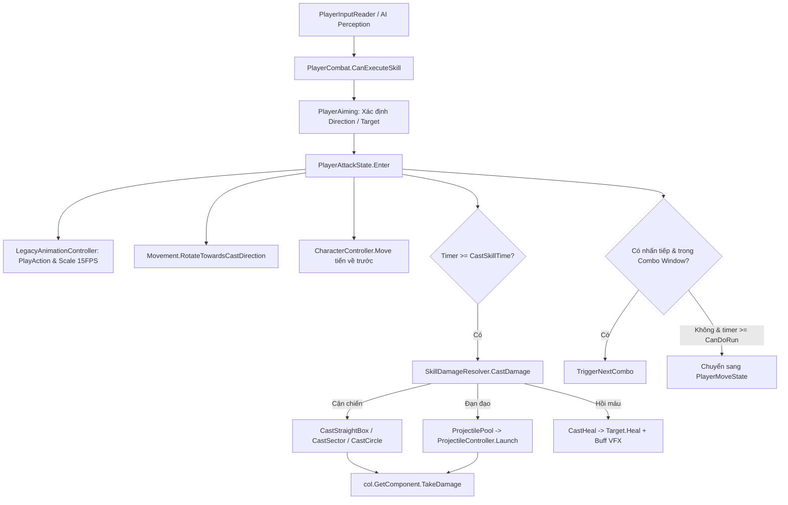
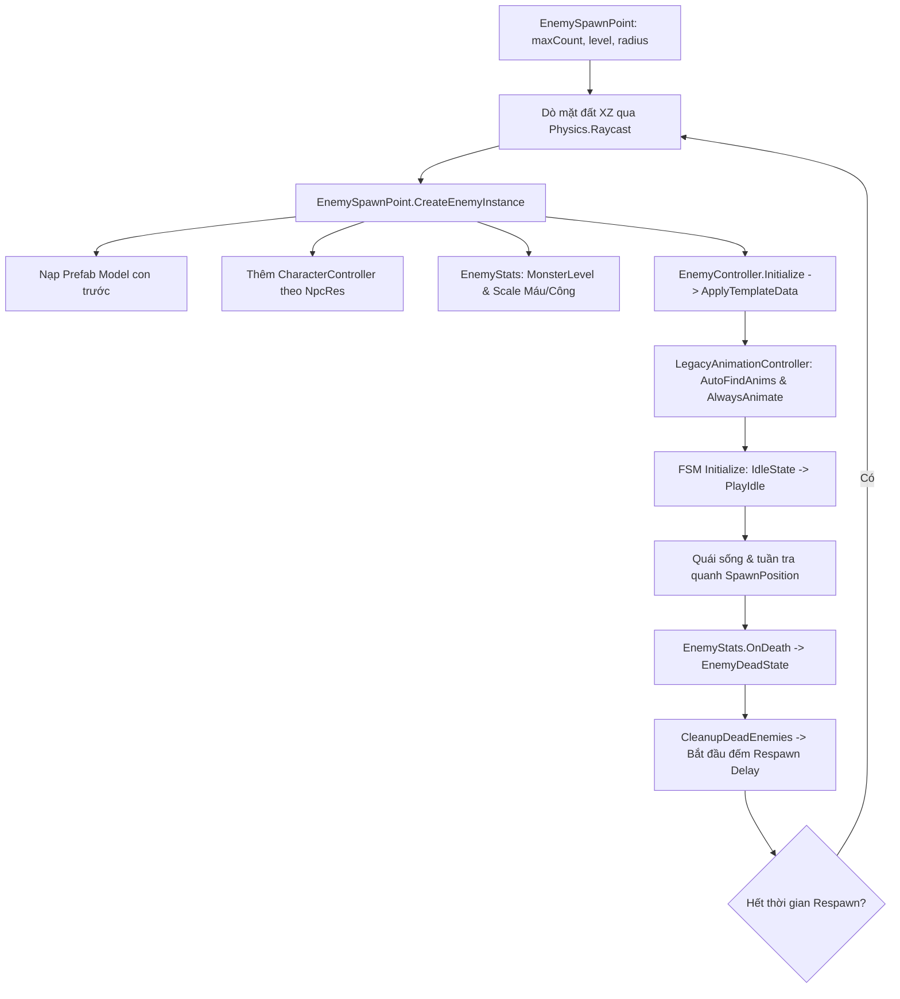

# 🧭 AI VIBE CODING & ARCHITECTURE GUIDE

> **Mục tiêu của tài liệu:** Cung cấp bản đồ kiến trúc, nguyên tắc kỹ thuật bất biến và bảng chỉ mục tác vụ (Task-to-File Mapping). Khi nhận yêu cầu mới, **AI CHỈ CẦN ĐỌC FILE NÀY** để xác định chính xác 1-2 script liên quan trực tiếp, không đọc toàn bộ codebase, tránh lãng phí token và tránh ảo giác logic.

---

## 1. TỔNG QUAN HỆ THỐNG & TECH STACK

* **Thể loại:** Top-Down Action RPG 3D (phong cách Kiếm Hiệp Võ Học, kế thừa hệ quy chuẩn dữ liệu võ lâm/JX/Kingsoft).
* **Engine & Input:** Unity (C# .NET), New Input System (`PlayerInputReader`), Cinemachine.
* **Architecture Pattern:** Data-Driven (CSV), Finite State Machine (FSM), Object Pooling (VFX, Projectiles, Audio).
* **Logic FPS Tiêu Chuẩn:** **15 FPS** ($\Delta t = \frac{1}{15} \approx 0.0667\text{s}$) cho hoạt ảnh, Action Event, Frame Timing và Cooldown.
* **Nguyên tắc bộ nhớ cốt lõi:** **Zero GC Allocation** trong vòng lặp chiến đấu (`Update`/`FixedUpdate`). Nghiêm cấm `new`, `GetComponent`, `FindObjectOfType`, hoặc cấp phát mảng tạm thời trong game loop.

---

## 2. CÁC NGUYÊN TẮC BẤT BIẾN (HARD RULES)

1. **Chuẩn Frame Timing (15 FPS):**
   * Chuyển đổi Frame sang giây: $t = \frac{\text{frame}}{15.0}$.
   * Tỉ lệ co giãn hoạt ảnh theo Tốc Đánh (`AttackSpeed`):
     $$\text{SpeedReduction} = \frac{\lfloor \text{AttackSpeed} / 10 \rfloor}{20}$$
     $$\text{FinalFrame} = \text{Clamp}(\text{Round}(\text{OriginalFrame} \times (1.0 - \text{SpeedReduction})), 9, 100)$$
     $$\text{SpeedFactor} = \frac{\text{OriginalFrame}}{\text{FinalFrame}}$$
2. **Animation thế hệ cũ (Legacy Animation):**
   * Model phân tách 2 GameObject con: `Body` và `Head`, đều gắn component `UnityEngine.Animation`.
   * **KHÔNG DÙNG** Animator Controller / Mecanim State Machine. Mọi chuyển động điều khiển qua `LegacyAnimationController.cs` và mã `CastActionID`.
3. **Data-Driven (CSV Source of Truth):**
   * Mọi thông số đọc từ `Assets/Settings/N/*.csv`. Không hardcode chỉ số kỹ năng, quái vật hay bán kính va chạm vào MonoBehaviour.
4. **VFX & Quản lý Khớp Xương (Bone Slots):**
   * Quản lý qua `PartSlotDatabase` và `VfxLockRotation` với 4 chế độ xoay:
     * `FollowBoneFull` (vũ khí/cánh - xoay $100\%$ theo xương)
     * `UprightBody` (ngực/thân - khóa Pitch/Roll, chỉ xoay mặt phẳng $OXZ$)
     * `FlatGround` (chân/đài sen/vòng sáng đất - bám theo gốc tọa độ mặt đất của nhân vật)
     * `FixedWorld` (đỉnh đầu/stun/buff - giữ nguyên góc xoay thế giới)
5. **Layers & Tags Quy Ước:**
   * Tag/Layer Người chơi: `"Player"` (Layer 3/Default tùy project).
   * Tag/Layer Quái vật: `"Enemy"` (Layer 6).
   * Khi tạo Enemy phải gán đệ quy tag & layer cho cả root lẫn toàn bộ bone/mesh con.

---

## 3. BẢN ĐỒ THƯ MỤC & TRÁCH NHIỆM FILE (FILE MAP)

```
Assets/Scripts/
├── Camera/
│   └── CinemachineDragInputProvider.cs # Bắt chuột phải / cần analog xoay camera Cinemachine
├── CameraFollow.cs                     # Camera bám theo Player mượt mà (dự phòng)
├── LegacyAnimationController.cs       # CỐT LÕI ANIMATION: Play/CrossFade Body + Head, scale theo 15 FPS
│
├── Combat/
│   ├── CombatEnums.cs                 # Toàn bộ Enums: NpcKind, NpcCamp, SkillTypeDef, HitboxShape, v.v.
│   ├── CombatFormula.cs               # STATIC PURE MATH: Đổi Frame sang Giây, tính Tốc Đánh, Damage, Heal
│   ├── DummyTarget.cs                 # Bia tập bắn / Bao cát test dame có thanh máu OnGUI
│   ├── EffectManager.cs               # VFX POOLING: SpawnEffect, SpawnEffectAtSlot, RecycleEffect
│   ├── IDamageable.cs                 # Interface nhận sát thương: TakeDamage(...)
│   └── VfxLockRotation.cs             # Khóa trục xoay VFX theo 4 chế độ (FlatGround, UprightBody, ...)
│
├── Data/
│   ├── CsvParserHelper.cs             # Parse dòng CSV, xử lý ngoặc kép, bóc tách chuỗi {Lv,Val} nội suy tuyến tính
│   ├── EffectDatabase.cs              # Nạp EffectRes.csv (đường dẫn prefab VFX, cờ lockRotate)
│   ├── ExpRuleDatabase.cs             # Nạp ExpRule.csv (ma trận % exp khi diệt quái theo cấp)
│   ├── FactionSkillDatabase.cs        # Nạp FactionSkill.csv (tra cứu icon, atlas và thông tin môn phái)
│   ├── FloatingTextData.cs / FloatingTextDatabase.cs # Nạp FloatingText.csv (cấu hình màu sắc, scale, pop, velocity)
│   ├── GameDatabase.cs                # Entry-point nạp toàn bộ CSV theo đúng Dependency Order
│   ├── ICsvTable.cs                   # Interface nạp/xóa bảng dữ liệu
│   ├── MissileDatabase.cs             # Nạp Missile.csv (tốc độ đạn, tầm nổ, hitbox shape, vfx fly/hit)
│   ├── NpcAttributeDatabase.cs        # Nạp NpcAttribute.csv (máu, công vật lý/ngũ hành theo cấp)
│   ├── NpcResData.cs / NpcResDatabase.cs # Nạp NpcRes.csv (chiều cao, độ rộng, ActionFrames, model prefab)
│   ├── PartSlotData.cs / PartSlotDatabase.cs # Nạp PartSlot.csv (tìm transform xương theo ID: B_RH, head...)
│   ├── PlayerLevelData.cs / PlayerLevelDatabase.cs # Nạp PlayerLevel.csv (EXP lên cấp, BaseAwardExp)
│   └── StateEffectDatabase.cs         # Nạp StateEffect.csv (VFX buff ngực/đầu theo thời gian)
│
├── Enemy/
│   ├── EnemyBrain.cs                  # Quản lý Cooldown skill quái, chọn skill sẵn sàng, gọi Resolver
│   ├── EnemyController.cs             # FSM Runner quái vật, CharacterController move, apply Template
│   ├── EnemyPerception.cs             # Nhận diện mục tiêu: visionRadius (phát hiện), activeRadius (leash)
│   ├── EnemySpawnPoint.cs             # SPAWN POINT: Quản lý bãi quái, tham số id, level, count, radius, respawn
│   ├── EnemyStats.cs                  # Máu quái (kế thừa EntityStats), MonsterLevel, exp calculation & reward
│   └── States/
│       ├── EnemyBaseState.cs          # State cơ sở
│       ├── EnemyIdleState.cs          # Đứng chờ / Đi bộ về điểm spawn nếu quá xa
│       ├── EnemyChaseState.cs         # Rượt theo Player khi trong Vision & Active Radius
│       ├── EnemyAttackState.cs        # Xoay về Player, play anim, apply dame tại mốc castSkill
│       ├── EnemyHurtState.cs          # Chạy anim bat (bị thương), dừng lại chờ hết anim
│       └── EnemyDeadState.cs          # Chạy anim die, tắt collider, hủy object sau delay
│
├── Input/
│   └── PlayerInputReader.cs           # Wrapper New Input System (Move, Attack, Skill1..3, Gamepad flag)
│
├── NPC/
│   ├── NpcTemplateCsvParser.cs        # Đọc NpcTemplate.csv và Character.csv
│   ├── NpcTemplateData.cs             # Cấu hình quái: ID, ResID, AttribID, skills, vision, speed
│   └── NpcTemplateDatabase.cs         # Tra cứu template quái vật theo ID
│
├── Player/
│   ├── CharacterMovement.cs           # Camera-relative movement, xoay nhân vật, trọng lực
│   ├── PlayerAiming.cs                # Smartcast, raycast chuột/gamepad, điều khiển Indicator VFX
│   ├── PlayerCombat.cs                # Quản lý Cooldown & Slot kỹ năng (Q-E-R, Attack), gọi SkillDamageResolver
│   ├── PlayerController.cs            # FSM Runner người chơi, facade kết nối Movement-Combat-Aiming
│   └── States/
│       ├── PlayerBaseState.cs         # State cơ sở người chơi
│       ├── PlayerIdleState.cs         # Đứng thủ thế (sta), lắng nghe Skill / Attack / Move
│       ├── PlayerMoveState.cs         # Chạy bộ (run), có thể ngắt để tung chiêu / đánh thường
│       ├── PlayerAttackState.cs       # ĐIỀU KHIỂN ĐÒN ĐÁNH: MovePos, InstantDir, Combo window, Cancel
│       └── PlayerHurtState.cs         # Chạy anim bat (bị thương), cho phép ngắt bằng Skill / Attack / Move
│
├── Skills/
│   ├── ActionEventParser.cs           # Parse ActionEvent.csv (CastSkill, CanDoSkill, CanDoRun, MovePos...)
│   ├── CastActionID.cs                # Enum & Helper ánh xạ CastActionID (16=at01, 21=jn01...) sang tên clip
│   ├── LegacySkillCsvParser.cs        # Parser dự phòng cho định dạng Skills.csv cũ
│   ├── ProjectileController.cs        # Quỹ đạo đạn, Homing, Chain-bouncing, DoT interval, SphereCast
│   ├── ProjectilePool.cs              # Object Pool đạn đạo tái sử dụng 100% (0 GC Alloc)
│   ├── SkillCsvParser.cs              # Parse Skill.csv chuẩn kết hợp ActionEvent.csv
│   ├── SkillDamageResolver.cs         # THUẬT TOÁN GÂY SÁT THƯƠNG: BoxCast, Sector, Circle, Projectile, Heal
│   ├── SkillData.cs                   # DTO kỹ năng: chỉ số, hitbox, frame mốc, sprite icon
│   ├── SkillDatabase.cs               # Tra cứu SkillData theo ID
│   └── SkillType.cs / VfxStartPosType.cs # Enums hình thái hitbox và vị trí xuất phát chiêu
│
├── StateMachine/
│   ├── IState.cs                      # Interface trạng thái FSM (Enter, Update, PhysicsUpdate, Exit)
│   └── StateMachine.cs                # Quản lý chuyển đổi State cơ sở
│
├── Stats/
│   ├── EntityStats.cs                 # Base stats: Máu, công vật lý/phép, AttackSpeed, IDamageable
│   ├── PlayerStats.cs                 # Mở rộng cho Player: Mana, Cấp độ (Level), Kinh nghiệm (Exp), LevelUp
│   └── ResourceStat.cs                # Cặp giá trị Current/Max, tự hồi máu/mana, phát Action event
│
├── UI/
│   ├── FloatingTextItem.cs            # Hiệu ứng chữ/số nảy 3D (Billboard, Scale Pop, Fade Out)
│   ├── FloatingTextManager.cs         # POOLING FLOATING TEXT: SpawnDamage, SpawnHeal, SpawnExp, Miss...
│   ├── PlayerHUD.cs                   # Điều khiển HUD: Máu lerp + Ghost Bar vàng, Mana, Level/EXP, 3 ô skill
│   └── SkillSlotUI.cs                 # Ô skill đơn lẻ: Icon, Overlay xoay 360°, đếm ngược số giây, Mana cost
│
├── Audio/
│   ├── SoundData.cs / SoundDatabase.cs# Tra cứu Sound.csv, Wwise event, CleanEventName
│   └── SoundManager.cs                # Pool 20 AudioSource, Random Container (Hit/Vo), Pitch variation
│
└── Editor/
    ├── ComboTimingAnalyzer.cs         # Tool dò khớp frame nối combo giữa 2 animation clips
    ├── EnemySpawnPointEditor.cs       # Custom Inspector & Menu tạo EnemySpawnPoint nhanh vào Scene
    ├── NpcSpawnerBuilder.cs           # Tool dựng nhanh quái/bãi quái ra Scene từ NpcTemplate.csv
    ├── PlayerAnimationPopulator.cs    # Tool quét thư mục nạp clips vào component Animation
    ├── PlayerHUDBuilder.cs            # Tool tạo tự động Canvas UI HUD chuẩn vào Scene
    ├── SkillEffectVerifier.cs         # Tool Unit Test kiểm tra tính toàn vẹn của Skill trong console
    └── SmartPackageImporter.cs        # Tool nhập .unitypackage tự động khử trùng Shader & C# GUID
```

---

## 4. BẢNG TRA CỨU NHANH THEO TÁC VỤ (AI TASK ROUTER)

> **Khi nhận một tác vụ cụ thể, AI CHỈ ĐỌC các file được liệt kê trong bảng dưới đây:**

| Tác vụ cần xử lý | Các file TRỌNG TÂM cần đọc & sửa | File phụ (chỉ đọc nếu thiếu context) |
| :--- | :--- | :--- |
| **Sửa logic Di chuyển / Điều khiển xoay / Trọng lực** | `Player/CharacterMovement.cs`<br>`Player/States/PlayerMoveState.cs` | `Player/PlayerController.cs` |
| **Sửa cơ chế Ngắm chiêu / Smartcast / Indicator** | `Player/PlayerAiming.cs` | `Combat/CombatEnums.cs` |
| **Sửa luồng Tung chiêu / Combo / Hủy đòn (Cancel)** | `Player/States/PlayerAttackState.cs`<br>`Player/PlayerCombat.cs` | `Skills/SkillData.cs`<br>`Combat/CombatFormula.cs` |
| **Sửa phản ứng Bị thương (Hit Reaction / Flinch)** | `Player/States/PlayerHurtState.cs`<br>`Enemy/States/EnemyHurtState.cs` | `LegacyAnimationController.cs`<br>`Stats/EntityStats.cs` |
| **Sửa thuật toán Va chạm Hitbox / Gây Sát thương / Hồi máu** | `Skills/SkillDamageResolver.cs` | `Skills/SkillData.cs`<br>`Stats/EntityStats.cs` |
| **Sửa cơ chế Đạn bay / Bám đuổi / Nảy đạn (Projectile)** | `Skills/ProjectileController.cs`<br>`Skills/ProjectilePool.cs` | `Data/MissileDatabase.cs` |
| **Thêm / Sửa thuộc tính Kỹ năng từ Database** | `Skills/SkillData.cs`<br>`Skills/SkillCsvParser.cs`<br>`Skills/ActionEventParser.cs` | `Data/GameDatabase.cs` |
| **Sửa AI / Hành vi Quái vật / Boss** | `Enemy/EnemyBrain.cs`<br>`Enemy/EnemyPerception.cs`<br>`Enemy/States/EnemyAttackState.cs` | `Enemy/EnemyController.cs` |
| **Sửa Hoạt ảnh / Khớp xương / Đồng bộ Body & Head** | `LegacyAnimationController.cs`<br>`Combat/VfxLockRotation.cs`<br>`Data/PartSlotDatabase.cs` | `Skills/CastActionID.cs` |
| **Sửa Chỉ số Máu, Mana, Cấp độ, Kinh nghiệm, Tốc đánh** | `Stats/EntityStats.cs`<br>`Stats/PlayerStats.cs`<br>`Data/PlayerLevelDatabase.cs`<br>`Data/ExpRuleDatabase.cs`<br>`Data/NpcAttributeDatabase.cs`<br>`Data/CsvParserHelper.cs` | `Stats/ResourceStat.cs`<br>`Combat/CombatFormula.cs` |
| **Sửa Giao diện / HUD / Hiệu ứng Cooldown** | `UI/PlayerHUD.cs`<br>`UI/SkillSlotUI.cs` | `Editor/PlayerHUDBuilder.cs` |
| **Sửa Số nhảy Sát thương / Floating Text (Dame, Heal, Exp, Miss)** | `UI/FloatingTextManager.cs`<br>`UI/FloatingTextItem.cs`<br>`Data/FloatingTextDatabase.cs` | `Data/FloatingTextData.cs`<br>`Settings/N/FloatingText.csv` |
| **Sửa Âm thanh / Tiếng chém trúng / Voice** | `Audio/SoundManager.cs`<br>`Audio/SoundDatabase.cs` | `Audio/SoundData.cs` |
| **Tạo Tool Editor mới hoặc chỉnh sửa Spawner** | `Enemy/EnemySpawnPoint.cs`<br>`Editor/EnemySpawnPointEditor.cs`<br>`Editor/NpcSpawnerBuilder.cs` | `Enemy/EnemyController.cs`<br>`NPC/NpcTemplateDatabase.cs` |

---

## 5. CÁC LUỒNG DỮ LIỆU CHÍNH (LIFECYCLE FLOWS)

### 5.1. Luồng Tung Chiêu & Áp Sát Thương (Skill Execution)


### 5.2. Luồng Sinh Quái Vật & Hồi Sinh (Enemy Spawning Lifecycle)


### 5.3. Thứ tự nạp dữ liệu (Dependency Loading Order)
Khi gọi `GameDatabase.EnsureLoaded()`, dữ liệu **phải** được nạp theo đúng trình tự sau để tránh `NullReferenceException`:
1. `Sounds` (`Sound.csv`)
2. `FloatingTexts` (`FloatingText.csv`)
3. `PlayerLevels` (`PlayerLevel.csv`)
4. `ExpRules` (`ExpRule.csv`)
5. `Effects` (`EffectRes.csv`)
6. `Missiles` (`Missile.csv`) $\rightarrow$ cần `EffectDatabase` để lấy đường dẫn VFX bay/nổ.
7. `StateEffects` (`StateEffect.csv`) $\rightarrow$ cần `EffectDatabase`.
8. `PartSlots` (`PartSlot.csv`)
9. `FactionSkills` (`FactionSkill.csv`)
10. `NpcRes` (`NpcRes.csv`)
11. `NpcAttributes` (`NpcAttribute.csv`)
12. `NpcTemplates` (`NpcTemplate.csv`, `Character.csv`) $\rightarrow$ cần `NpcRes` & `NpcAttribute`.
13. `Skills` (`Skill.csv`, `ActionEvent.csv`) $\rightarrow$ cần toàn bộ các bảng trên.

---

## 6. CÁC LỖI THƯỜNG GẶP CẦN TRÁNH TUYỆT ĐỐI (AI PITFALLS)

* ❌ **KHÔNG** dùng `Animator.Play(...)` hay `animator.SetTrigger(...)`. Hệ thống dùng component `Animation` (Legacy). Luôn dùng `LegacyAnimationController.PlayAction(...)`.
* ❌ **KHÔNG** tự ý đổi hệ số chia thời gian sang 30 FPS hoặc 60 FPS. Mọi mốc frame trong `ActionEvent.csv` và `NpcRes.csv` đều chuẩn hóa theo **15 FPS**.
* ❌ **KHÔNG** gọi `Instantiate()` cho đạn bay hoặc hiệu ứng lặp đi lặp lại. Phải dùng `ProjectilePool.Instance.Get()` và `EffectManager.Instance.SpawnEffect(...)`.
* ❌ **KHÔNG** dùng `Physics.OverlapSphere` (sinh rác GC). Luôn dùng phiên bản NonAlloc với bộ đệm tĩnh: `Physics.OverlapSphereNonAlloc(..., hitBuffer, ...)`.
* ❌ **KHÔNG** xóa bỏ hàm gán Tag/Layer đệ quy khi tạo quái. Nếu các GameObject con chứa Mesh/Collider không mang layer `Enemy`, `PlayerAiming` và `SkillDamageResolver` sẽ bỏ qua mục tiêu.
* ❌ **KHÔNG** tạo `LegacyAnimationController` trước khi nạp Model Prefab con khi sinh quái động (Dynamic Spawn). Phải nạp Model Prefab con trước hoặc gọi `AutoFindAnimationComponents()` sau khi gắn model và luôn đặt `Animation.cullingType = AnimationCullingType.AlwaysAnimate` để tránh mất animation ngoài frustum camera.