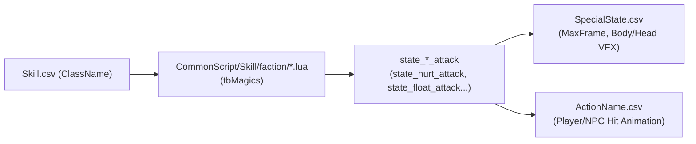

# 🛡️ CÔNG THỨC CHIẾN ĐẤU, NGŨ HÀNH & TRẠNG THÁI KHỐNG CHẾ

> **Tài liệu thành phần:** Nằm trong bộ quy chuẩn dữ liệu [DATA_CONVENTIONS_V2.md](../DATA_CONVENTIONS_V2.md).
> **Phạm vi:** Công thức tính toán sát thương, bạo kích, chính xác/né tránh, khắc chế hệ ngũ hành (SkillSetting.ini, SkillConstant.csv) và hệ thống trạng thái bất lợi / khống chế (SpecialState.csv, scripts Lua).

---

## 8. CÔNG THỨC TÍNH TOÁN CHIẾN ĐẤU & KHẮC CHẾ NGŨ HÀNH (`SkillSetting.ini` & `SkillConstant.csv`)

Toàn bộ hằng số theo cấp độ được tra cứu trực tiếp từ [SkillConstant.csv](file:///C:/Users/zolcol/Desktop/Data/CSV/N/SkillConstant.csv).

### 1. Tỉ Lệ Đánh Trúng (Hit Rate):
$$\text{Hit Rate} = \text{Defender.HitParam0} \times \frac{\text{Attacker.Hit}}{\text{Attacker.Hit} + \text{Defender.HitParam1}}$$
* Giới hạn kẹp: $\text{Hit Rate} \in [20\%, 98\%]$ (`HitPercentMin=20`, `HitPercentMax=98`).

### 2. Tỉ Lệ Né Tránh (Dodge Rate):
$$\text{Dodge Rate} = \text{Attacker.MissParam0} \times \frac{\text{Defender.Dodge}}{\text{Defender.Dodge} + \text{Attacker.MissParam1}}$$

### 3. Tỉ Lệ Bạo Kích & Sát Thương Bạo Kích (Deadly Strike):
$$\text{Crit Rate} = \text{Defender.DeadlyStrikeParam0} \times \frac{\text{Attacker.DeadlyStrike}}{\text{Attacker.DeadlyStrike} + \text{Defender.DeadlyStrikeParam1}}$$
$$\text{Crit Damage} = \text{Base Damage} \times (180\% + \text{Attacker.CritDmg\%} - \text{Defender.CritDef\%})$$

### 4. Giảm Sát Thương Kháng Ngũ Hành (Series Resist):
$$\text{Resist Rate} = \text{Attacker.SeriesResistParam0} \times \frac{\text{Defender.SeriesResist}}{\text{Defender.SeriesResist} + \text{Attacker.SeriesResistParam1}}$$
* Giới hạn kháng tối đa: $85\%$ (`MaxSeriesResistPercent=85`).
* Bỏ qua kháng tối đa: $75\%$ (`MaxIgnoreResistPercent=75`).

### 5. Tương Khắc Ngũ Hành:
* **Khi Khắc hệ:** Sát thương $= \text{Damage} \times (1 + 30\%)$, Tỉ lệ dính hiệu ứng $= \text{Rate} \times (1 + 30\%)$ (`SeriesDamageP=30`, `SpecialStateRateP=30`).
* **Khi Bị Khắc hệ:** Sát thương $= \text{Damage} / (1 + 30\%)$, Tỉ lệ dính hiệu ứng $= \text{Rate} / (1 + 30\%)$.

---

---

## 9. HỆ THỐNG TRẠNG THÁI BẤT LỢI, KHỐNG CHẾ & QUY ƯỚC THƯƠNG TÍCH (`SpecialState.csv` / `CommonScript/Skill/`)

### 🧠 1. Nguyên Lý Ánh Xạ Hiệu Ứng Bị Thương Từ Lua Sang Database
Trong hệ thống của Kingsoft/Seasun, `Skill.csv` không lưu cứng chuỗi hiệu ứng khống chế trong một cột đơn lẻ mà thông qua trường **`ClassName`** (hoặc Sub-skill qua `ChildID`, `HitSkillID`, `FlySkillId`).
`ClassName` liên kết tới bảng ma pháp trong các file `CommonScript/Skill/faction/*.lua` (hoặc `npc/*.lua`, `partner/*.lua`), nơi các hiệu ứng thương tích được khai báo bằng tiền tố **`state_<StateName>_attack`**:



---

### 📋 2. Bảng Ánh Xạ Toàn Bộ Thuộc Tính Gây Thương Tích & Trạng Thái (`SpecialState.tab` / `NpcDefine.lua`):

| Thuộc tính trong Lua | Trạng thái tương ứng | Max Frame (15 FPS) | VFX Resource / HeadWord | Cơ chế tác động & Phản ứng bị thương |
| :--- | :---: | :---: | :---: | :--- |
| **`state_hurt_attack`** | `hurt` (0) | 75 frames (5.0s) | — | **Bị thương** (ngắt động tác, khựng giật mình tức thời). |
| **`state_zhican_attack`** | `zhican` (1) | 900 frames (60.0s)| Body 60 | **Tàn phế** (không thể dùng chiêu / di chuyển). |
| **`state_slowall_attack`** | `slowall` (2) | 90 frames (6.0s) | Body 58 | **Trì hoãn** (giảm 10% toàn bộ tốc đánh & tốc chạy). |
| **`state_palsy_attack`** | `palsy` (3) | 75 frames (5.0s) | Body 61 | **Tê liệt** (đứng khựng ngắt quãng liên tục). |
| **`state_stun_attack`** | `stun` (4) | 75 frames (5.0s) | Head 68 | **Choáng** (bất động hoàn toàn, cấm mọi thao tác). |
| **`state_fixed_attack`** | `fixed` (5) | 75 frames (5.0s) | Body 59 | **Định thân** (khóa chân tại chỗ, vẫn dùng được chiêu tầm xa). |
| **`state_weak_attack`** | `weak` (6) | 900 frames (60.0s)| Body 66 / ColorId 4 | **Suy yếu** (sát thương gây ra giảm còn 80%, đổi màu xám/xanh). |
| **`state_burn_attack`** | `burn` (7) | 150 frames (10.0s)| Body 63 / ColorId 3 | **Thiêu đốt** (nhận thêm tối đa +50% sát thương Hỏa, tint đỏ). |
| **`state_slowrun_attack`** | `slowrun` (8) | 75 frames (5.0s) | — | **Làm chậm** tốc độ di chuyển. |
| **`state_freeze_attack`** | `freeze` (9) | 900 frames (60.0s)| Body 9001 | **Đóng băng** (hóa băng, miễn sát thương và bất động). |
| **`state_confuse_attack`** | `confuse` (10) | 75 frames (5.0s) | Head 65 | **Hỗn loạn** (mất kiểm soát, chạy loạn xạ). |
| **`state_knock_attack`** | `knock` (11) | 75 frames (5.0s) | — | **Đẩy lùi** (bị đẩy trượt lùi ra xa vị trí Caster). |
| **`state_drag_attack`** | `drag` (12) | 75 frames (5.0s) | **Body 3507** | **Kéo lại** (bị hút mạnh về tâm chiêu thức). |
| **`state_silence_attack`** | `silence` (13) | 900 frames (60.0s)| Head 64 / IsAlpha 1 | **Câm lặng** (cấm dùng kỹ năng, chỉ đánh thường/chạy). |
| **`state_float_attack`** | `float` (14) | 900 frames (60.0s)| **PosResId 62** | **Đánh bay / Hất tung** lên không 2.0m (`FloatHeight=200`). |
| **`state_selffreeze_attack`**| `selffreeze` (15)| 900 frames (60.0s)| — | **Tự đóng băng** hộ mệnh/kim thiền. |
| **`state_sleep_attack`** | `sleep` (16) | 900 frames (60.0s)| Head 67 | **Ngủ say** (bất động, nhận sát thương sẽ tỉnh lại ngay). |
| **`state_knock2_attack`** | `knock2` (17) | 900 frames (60.0s)| — | **Đẩy lùi xa**. |
| **`state_nojump_attack`** | `nojump` (18) | 900 frames (60.0s)| **Body 1457** | **Khóa khinh công** (cấm dùng kỹ năng nhảy/lướt né). |
| **`state_forceatk_attack`**| `forceatk` (19)| 900 frames (60.0s)| Head 296 | **Khiêu khích** (bắt buộc mục tiêu phải tấn công mình). |
| **`state_dragfloat_attack`**| `dragfloat` (20)| 75 frames (5.0s)| — | **Kéo xuống đánh bay** (kéo từ trên không xuống đất rồi hất tung). |
| **`state_npchurt_attack`** | `npchurt` (**21**) | 30 frames (2.0s) | — | **Bị thương riêng cho NPC quái** (giật khựng). |
| **`state_npcknock_attack`**| `npcknock` (**22**) | 75 frames (5.0s) | — | **Đẩy lùi riêng cho NPC quái**. |
| — | `hide` (23) | 0 (Vô hạn/theo buff) | IsAlpha 1 | **Ẩn thân / Tàng hình**. |
| — | `shield` (24) | 0 (Theo lượng khiên)| HeadWord "Thuẫn" | **Hộ thuẫn Tọa Vọng Vô Ngã** (Hấp thụ sát thương theo điểm). |
| — | `fixshield` (25) | 0 | Body 2867 | **Hộ thuẫn cố định Du Long Kiếm Ý**. |
| — | `shield_ext` (26) | 0 | HeadWord "Thuẫn" | **Hộ thuẫn mở rộng Vân Sinh Kết Hải**. |
| — | `shield_share` (27) | 0 | HeadWord "Ngự" | **Hộ thuẫn chia sẻ Bàn Băng Phi Sương**. |

---

### 📐 3. Cấu Trúc Tham Số Trong File Script Lua:

#### 🔹 Cú pháp cơ bản (Tỉ lệ & Thời gian):
$$\text{state\_<Name>\_attack} = \{\text{TỉLệ\%}, \text{ThờiGian\_Frames}\}$$
* Có thể là giá trị cố định: `state_hurt_attack = { 80, 6 }` ($80\%$ tỉ lệ gây bị thương trong 6 frames = 0.4s).
* Hoặc scale tăng dần theo cấp độ kỹ năng:
  `state_slowall_attack = { {{1, 30}, {20, 50}}, {{1, 15*1.5}, {20, 15*2}} }`

#### 🔹 Cú pháp khống chế vị trí & hoạt ảnh (`state_knock_attack` & `spe_knock_param`):
```lua
state_knock_attack = { 100, 5, 70 },        -- { Tỉ lệ %, Thời gian (frames), Tốc độ / Cự ly }
spe_knock_param = { 11, 4, 26 },            -- { Thời gian dừng khựng, Player_ActId, Npc_ActId }
spe_knock_param1 = { 1 },                   -- Cờ kích hoạt ép buộc đổi animation
```
* **`Player_ActId` & `Npc_ActId`** trỏ trực tiếp sang `ActId` trong [ActionName.csv](file:///C:/Users/zolcol/Desktop/Data/CSV/N/ActionName.csv):
  * `4` = `jt` (Knockback - Bị đẩy lùi trượt chân).
  * `9` = `bat` (Hit Flinch - Bị thương giật mình tại chỗ).
  * `26` = `jf` (Knockup - Đánh bay tung lên không).

#### 🔹 Cơ chế kích hoạt qua Bí kíp (`add_hitskill` & `skill_randskill`):
Kỹ năng bị động của bí kíp gắn hook vào chiêu gốc để kích hoạt ngẫu nhiên các hiệu ứng khống chế:
* `add_hitskill2 = { SkillGốc_ID, SubSkill_ID, {{1,1}, {10,10}} }`: Khi chiêu gốc đánh trúng, gọi SubSkill.
* `skill_randskill1..5 = { {10, 50}, TargetSkill_ID, {10, 10} }`: Tung xúc xắc ngẫu nhiên 1 trong các chiêu khống chế con (Suy yếu, Hỗn loạn, Câm lặng, Trì hoãn, Đóng băng).

---

### ⏱️ 4. Công Thức Tính Thời Gian Khống Chế Thực Tế Khi Giao Tranh:
$$\text{Effect Duration} = \min\left(\text{MaxFrame}, \text{BaseTime} \times \left(1 + \frac{\text{AtkAddTime}}{\text{AtkAddTime} + \text{DefStateBaseTime}} - \frac{\text{DefSubTime}}{\text{DefSubTime} + \text{DefStateBaseTime}}\right)\right)$$

---
