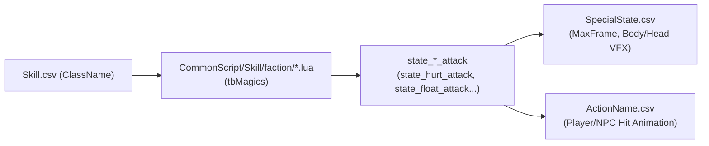

# 📘 TÀI LIỆU QUY ƯỚC & NGUYÊN LÝ DỮ LIỆU GAME (DATA CONVENTIONS & SYSTEM ARCHITECTURE)

Tài liệu này tổng hợp toàn bộ quy ước, định nghĩa biến, công thức toán học/vật lý, bảng mã Enum và nguyên lý vận hành của hệ thống Combat / Skill / Animation / Targeting & Selector / NPC / Buff / VFX / Audio trích xuất từ dữ liệu game Kiếm Hiệp (Seasun / Kingsoft). 

> **Toàn bộ thông số và công thức đã được đối chiếu, kiểm chứng thực tế và chứng minh bằng source code (`SkillSetting.ini`, `Define.lua`, `NpcDefine.lua`, `FightSkill.lua`, `FightSkillC.lua`, các bảng `.tab` và `.csv` tương ứng).**

---

## 📑 MỤC LỤC
1. [Hệ Thống Đơn Vị Đo Lường & Công Thức Quy Đổi Unity](#1-hệ-thống-đơn-vị-đo-lường--công-thức-quy-đổi-unity)
2. [Chi Tiết Bảng `Skill.csv` (Kỹ Năng & Logic Xuất Chiêu)](#2-chi-tiết-bảng-skillcsv)
3. [Giải Mã Tham Số Đa Biến Trong `Skill.csv` (`Param1..Param6`, `AcceSpeedInfo`, `MSGenerate`, `DoT`)](#3-giải-mã-tham-số-đa-biến-trong-skillcsv)
4. [Chi Tiết Bảng `Missile.csv` (Đạn Đạo, Hitbox & Tham Số Đặc Biệt)](#4-chi-tiết-bảng-missilecsv)
5. [Chi Tiết Bảng `ActionEvent.csv` & `ActionEventDes.csv` (Timeline Từng Frame Sự Kiện)](#5-chi-tiết-bảng-actioneventcsv--actioneventdescsv)
6. [Nguyên Lý Scale Animation & Công Thức Tốc Đánh (Attack Speed) Chuẩn](#6-nguyên-lý-scale-animation--công-thức-tốc-đánh-attack-speed-chuẩn)
7. [Hệ Thống Định Hướng, Chỉ Định Mục Tiêu & Cấu Hình Selector](#7-hệ-thống-định-hướng-chỉ-định-mục-tiêu--cấu-hình-selector)
8. [Công Thức Tính Toán Chiến Đấu & Khắc Chế Ngũ Hành (`SkillSetting.ini` & `SkillConstant.csv`)](#8-công-thức-tính-toán-chiến-đấu--khắc-chế-ngũ-hành-skillsettingini--skillconstantcsv)
9. [Hệ Thống Trạng Thái Bất Lợi, Khống Chế & Quy Ước Thương Tích (`SpecialState.csv` / `CommonScript/Skill/`)](#9-hệ-thống-trạng-thái-bất-lợi-khống-chế--quy-ước-thương-tích-specialstatecsv--commonscriptskill)
10. [Chi Tiết Bảng `AutoSkill.csv` (Cơ Chế Tự Động Kích Hoạt Chiêu Thức)](#10-chi-tiết-bảng-autoskillcsv)
11. [Chi Tiết Bảng `SkillLevelUp.csv` & `SkillSlot.csv`](#11-chi-tiết-bảng-skilllevelupcsv--skillslotcsv)
12. [Chi Tiết Bảng `NpcRes.csv` (Kích Thước 3D, Collider & Frame Hoạt Ảnh)](#12-chi-tiết-bảng-npcrescsv)
13. [Chi Tiết Bảng `ActionName.csv` (Từ Điển Tên Hoạt Ảnh Chuẩn)](#13-chi-tiết-bảng-actionnamecsv)
14. [Chi Tiết Bảng `NpcTemplate.csv` & `Field_HeaderBoss.csv` (Dữ Liệu Quái, Boss & Nhân Vật)](#14-chi-tiết-bảng-npctemplatecsv--field_headerbosscsv)
15. [Chi Tiết Bảng `NpcAttribute.csv` & `MagicDesc.csv` (Chỉ Số Thuộc Tính)](#15-chi-tiết-bảng-npcattributecsv--magicdesccsv)
16. [Chi Tiết Bảng `EffectRes.csv` (Tài Nguyên Prefab VFX & Vũ Khí Thần Binh)](#16-chi-tiết-bảng-effectrescsv)
17. [Chi Tiết Bảng `StateEffect.csv`, `PartSlot.csv` & Quản Lý Khớp Gắn VFX](#17-chi-tiết-bảng-stateeffectcsv-partslotcsv--quản-lý-khớp-gắn-vfx)
18. [Chi Tiết Bảng `FactionSkill.csv` & `Sound.csv`](#18-chi-tiết-bảng-factionskillcsv--soundcsv)
19. [Tổng Hợp Toàn Bộ Bảng Mã Enum & Struct Chuẩn C# Cho Unity](#19-tổng-hợp-toàn-bộ-bảng-mã-enum--struct-chuẩn-c-cho-unity)
20. [Hệ Thống Cấp Độ, Kinh Nghiệm Người Chơi & Cơ Chế EXP Quái Rơi (`PlayerLevel.csv` & `ExpRule.csv`)](#20-hệ-thống-cấp-độ-kinh-nghiệm-người-chơi--cơ-chế-exp-quái-rơi-playerlevelcsv--exprulecsv)
21. [Hệ Thống AI Quái Cơ Bản (`CommonActive.ini` & `CommonPassive.ini`)](#21-hệ-thống-ai-quái-cơ-bản-commonactiveini--commonpassiveini)

---

## 1. HỆ THỐNG ĐƠN VỊ ĐO LƯỜNG & CÔNG THỨC QUY ĐỔI UNITY

Toàn bộ hệ thống logic thời gian và chuyển động trong database được thiết kế chạy trên nền **chuẩn 15 FPS**.

| Đại lượng trong CSV | Đơn vị gốc | Tỉ lệ quy đổi | Đơn vị Unity C# | Công thức tính trong Unity | Bằng chứng mã nguồn |
| :--- | :--- | :---: | :--- | :--- | :--- |
| **Thời gian Frame (`LifeTime`, `TimePerCast`, `ReviveFrame`...)** | 1 frame (chuẩn **15 FPS**) | $\div 15$ | Giây (Seconds) | `float timeSec = frame / 15.0f;` | `AutoSkillTimeDelay=15` (1 giây kiểm tra 1 lần) |
| **Góc quay tức thời (`InstantDir`)** | 1 frame góc quay (chuẩn **45 FPS**) | $\div 45$ | Độ/giây (°/s) | `float rotSpeed = val * 45.0f;` | `ActionEventDes.tab`: "Frame này 45 frame/giây" |
| **Góc chia xòe quạt (`Param2` trong `MissileForm = 2`)** | Binary Angle ($64\text{ units} = 360^\circ$) | $\times 5.625^\circ$ | Độ (Degrees) | `float angleDeg = val * (360f / 64f);` | `Skill.tab`: "tổng góc là 64° = 360°" |
| **Khoảng cách / Tầm đánh (`AttackRadius`, `PosOffsetLenght`, `VisionRadius`)** | Centimet (cm) | $\div 100$ | Mét (Meters) | `float rangeMeter = val / 100.0f;` | `ActionEventDes.tab`: "1 là 1 cm" |
| **Bán kính sát thương Đạn (`DmgRange`, `DamageRadius`)** | Decimet (dm) | $\div 10$ | Mét (Meters) | `float dmgRadius = dmgRange / 10.0f;` | `AttackSkill.tab`, `PreciseCastSkill.tab` |
| **Vận tốc bay (`Speed`)** | Game Speed Unit | $\div 10$ | Mét/giây (m/s) | `float velocity = speed / 10.0f;` | Đối chiếu đạn tầm xa 301 |
| **Gia tốc (`AcceSpeed`)** | Game Acce Unit | $\div 10$ | $m/s^2$ | `float accel = acceSpeed / 10.0f;` | `Missile.tab` |
| **Tốc độ di chuyển (`RunSpeed`, `WalkSpeed`)** | cm/frame (tại 15 FPS) | $\times 15 \div 100$ | Mét/giây (m/s) | `float moveSpeed = runSpeed * 15.0f / 100.0f;` | `AutoRunSpeed.lua`: `nTimeFrame = nPathLen / nRunSpeed` với `nPathLen` đơn vị cm và `GAME_FPS=15`. VD: `RunSpeed=27` → `27×15/100 = 4.05 m/s` |
| **Cường độ chớp sáng (`CollBrigth`, `AlphaEffect`)** | $0 \sim 1000$ | $\div 1000$ | $0.0f \sim 1.0f$ | `float flashAlpha = collBrigth / 1000.0f;` | `SkillSetting.ini`: `AlphaEffect=500` ($0.5$) |
| **Tỉ lệ phần trăm (`%`)** | $0 \sim 100$ | $\div 100$ | $0.0f \sim 1.0f$ | `float percent = val / 100.0f;` | Standard percentage |

---

## 2. CHI TIẾT BẢNG `Skill.csv`

Bảng định nghĩa thuộc tính cốt lõi của mọi chiêu thức.

| Tên Cột | Kiểu | Ý nghĩa & Nguyên lý vận hành | Bằng chứng Source Code |
| :--- | :---: | :--- | :--- |
| **`SkillId`** | `int` | ID duy nhất của kỹ năng (Khóa chính). | `Skill.tab` |
| **`SkillName`** | `string` | Tên hiển thị của kỹ năng (Tiếng Việt). | `Skill.tab` |
| **`Property`** | `string` | Phân loại ngữ cảnh (`Kỹ năng môn phái`, `Thử nghiệm`, `Buff`...). | `Skill.tab` |
| **`SkillType`** | `int` | **Phân loại cơ chế xuất chiêu:**<br>• `0`: Vô hiệu / None.<br>• `1`: **Kỹ năng áp sát cận chiến / khinh công** (`skill_type_melee`).<br>• `2`: **Tác dụng tức thì đơn thể** (`skill_type_inst_single`).<br>• `3`: **Bị động / Trạng thái nội tại** (`skill_type_passivity`).<br>• `4`: **Đạn tức thì / Không delay** (`skill_type_inst_missile`).<br>• `5`: **Đạn có quỹ đạo bay** (`skill_type_missile`). | `CommonScript/Skill/Define.lua` (`FightSkill.SkillTypeDef`) |
| **`MeleeForm`** | `int` | Kiểu đánh cận chiến: `0`/rỗng = Bình thường, `1` = Lướt áp sát nhanh, `2` = Xoay vòng quanh người. | `Skill.tab` |
| **`StartPosType`** | `int` | **Vị trí xuất phát chiêu/đạn:**<br>• `1`: Xuất phát từ **Caster** (Bản thân người ra chiêu).<br>• `2`: Xuất phát hướng về / tại **Target** (Mục tiêu đang khóa).<br>• `3`: Xuất phát tại **Điểm va chạm (HitPoint)**. | `Skill.tab` |
| **`StartDirType`** | `int` | Hướng ngắm ban đầu: `0` = Hướng mặt nhân vật, `1` = Hướng vector chỉ tới mục tiêu. | `Skill.tab` |
| **`ChildID`** | `int` | ID Missile hoặc Sub-skill sinh ra khi thi triển (Trỏ sang `Missile.csv` hoặc `Skill.csv`). | `Skill.tab` |
| **`ChildCount`** | `int` | Số lượng đạn/tia sinh ra trong 1 lần xuất chiêu. | `Skill.tab` |
| **`MissileForm`** | `int` | **Dạng đạn đạo / Hình thái Missile:**<br>• `1`: Đạn bay thẳng bình thường (Linear Straight).<br>• `2`: Đạn bắn chùm hình quạt (Spread Fan).<br>• `3`: Vòng tròn tỏa ra xung quanh Caster (Circular Ring).<br>• `4`: **Đạn nảy bật liên hoàn (Chain / Bouncing)** giữa các mục tiêu (vd: Bạch Lộ Ngưng Sương - Skill 308).<br>• `5`: Rơi từ trên trời xuống (Sky Drop / Meteor).<br>• `6`: Vòng tròn AOE tĩnh.<br>• **`7`**: **Chùm đa đạn đồng loạt / Sóng tỏa** (vd: Nga Mi Kiếm Pháp 4 - Skill 305, Giang Hải Ngưng Ba - Skill 310). | `Skill.tab` |
| **`Relation`** | `string` | **Quy tắc quan hệ lọc mục tiêu:**<br>• Cú pháp logic: `+` (Bắt buộc phải có), `-` (Bắt buộc KHÔNG được có), không tiền tố (Có là hợp lệ).<br>• Ví dụ `recover=+assist,self,team,partner,teampartner,-enemy,-dead`. | `SkillSetting.ini` (`[RelationSet]`) |
| **`TimePerCast`** | `int` | Thời gian hồi chiêu (Cooldown) tính theo frame chuẩn 15 FPS (`Cooldown = TimePerCast / 15.0f` giây). | `Skill.tab` |
| **`Series`** | `int` | Ngũ hành kỹ năng: `0`=Vô, `1`=Kim, `2`=Mộc, `3`=Thủy, `4`=Hỏa, `5`=Thổ. | `NpcDefine.lua` (`Npc.Series`) |
| **`CastActionId`** | `int` | ID hoạt ảnh ra đòn (Trỏ sang `ActionName.csv`). | `Skill.tab` |
| **`ActionEventID`** | `int` | ID dòng thời gian sự kiện hoạt ảnh (Trỏ sang `ActionEvent.csv`). | `Skill.tab` |
| **`StateEffectId`** | `int` | ID hiệu ứng trạng thái buff/debuff gắn kèm (Trỏ sang `StateEffect.csv`). | `Skill.tab` |
| **`SkillStyle`** | `string` | Phong cách chiêu: `normal_melee`, `skill_melee`, `normal_remote`, `skill_remote`, `skill_trigger`, `poison`, `control`, `heal`, `jump`, `buff_attack`, `buff_ex`, `buff_sp`, `curse`, `aura`, `logic`, `show`... | `SkillSetting.ini` (`[SkillStyleDef]`) |
| **`FlySkillId`** | `int` | **ID Sub-skill kích hoạt theo nhịp** khi đạn/vùng đang tồn tại (DoT / HoT). | `Skill.tab` |
| **`FlyEventInterval`**| `int` | Nhịp thời gian gọi `FlySkillId` (Frames, `15` frames = 1 giây/lần). | `Skill.tab` |
| **`AttackRadius`** | `int` | Tầm thi triển tối đa tính bằng Centimet (`AttackRadius / 100.0f = Mét`). | `Skill.tab` |
| **`ClassName`** | `string` | Tên hàm xử lý script Lua môn phái (vd: `em_pg1`, `em_chpd`, `em_blns`). | `CommonScript/Skill/FightSkill.lua` |
| **`CostType`** | `int` | Loại tài nguyên tiêu hao: `0` = Không tốn, `1` = Mana/Nội lực, `2` = Nộ khí (Anger, max `1000`). | `SkillSetting.ini` (`FullAnger=1000`) |
| **`NotChangeActFrame`**| `int (0/1)`| `1` = Khóa cứng frame hoạt ảnh, KHÔNG bị tăng tốc bởi `AttackSpeed`. | `Skill.tab` |

---

## 3. GIẢI MÃ THAM SỐ ĐA BIẾN TRONG `Skill.csv`

### 🔄 1. Bảng Tra Cứu `Param1..Param6` Theo `MissileForm`:

| `MissileForm` | Ý nghĩa `Param1` | Ý nghĩa `Param2` | Ý nghĩa `Param3` | Ý nghĩa `Param4` | Ý nghĩa `Param5` |
| :---: | :--- | :--- | :--- | :--- | :--- |
| **`1` (Bay thẳng)** | Vị trí đạn ban đầu (Start Offset) | Góc giữa các viên đạn | — | — | — |
| **`2` (Bắn chùm hình quạt)** | Cự ly đến tâm vòng tròn (cm) | Góc chia giữa các tia ($64^\circ = 360^\circ$) | Số tia đạn tỏa | — | — |
| **`3` (Vòng tròn quanh người)** | Bán kính vòng tròn ban đầu | Góc phân bố các tia đạn ($64^\circ$) | — | — | — |
| **`4` (Nảy bật liên hoàn - Chain)** | **Số lần nảy tối đa** (vd: 5 lần) | **Tự động tìm mục tiêu** (`1` = Bật) | **Tầm quét tìm mục tiêu nảy** (cm, vd: 1000cm) | **Số lần nảy lặp lại trên cùng 1 người** (`0` = không giới hạn) | Người đầu tiên trúng đòn có cho nảy tiếp không (`0/1`) |
| **`6` (AOE Vùng tròn tĩnh)** | Bán kính hình tròn (vd: `100` = $1.0\text{m}$) | — | — | — | — |
| **`7` (Chùm đa đạn đồng loạt / Sóng tỏa)** | Khoảng cách cự ly giữa các tia đạn (cm) | — | — | — | — |
| **Trống / Khinh công (Lướt/Dash)** | Tốc độ gia tốc lướt về trước | Frame tối thiểu của động tác | Cự ly lướt tối đa (cm) | Độ dài phá vỡ phòng ngự | Số lần đánh tối đa trên cùng 1 người |

---

### 🏃 2. Cơ Chế Lướt & Khinh Công (`AcceSpeedInfo1..3`):
Trong các chiêu thức lướt (Nhất Kích Sát Thần, Tiên Nhân Chỉ Lộ, Bôn Lang Thương) và Khinh công:
* **Định dạng chuỗi:** `GiaTốc | TốcĐộKhởiĐiểm | VậnTốcTốiĐa` (Ví dụ: `20|1|100`, `0|1|82`, `-1|20|90`, `-10|50|90`).
  - **`Gia tốc` (Số 1):** 
    - Nếu giá trị **dương** (vd: `20`): Lướt tăng tốc dần (Dash Acceleration).
    - Nếu giá trị **âm** (vd: `-1`, `-10`): Lướt giảm tốc dần (De-acceleration).
    - Nếu giá trị bằng **`0`**: Lướt với vận tốc đều cố định.
  - **`Tốc độ khởi điểm` (Số 2):** Vận tốc ban đầu ngay lúc bắt đầu động tác.
  - **`Vận tốc tối đa` (Số 3):** Ngưỡng tốc độ kẹp trần khi lướt.

---

### ⏳ 3. Cơ Chế Sát Thương Đa Đợt, Nhịp Sinh Đạn & Bãi Đất DoT (`MSGenerate`, `MSGenerateParam`, `ChildCount`, `FlySkillId`):
Game hỗ trợ 3 cơ chế gây sát thương / hồi máu đa đợt khác nhau, phối hợp chặt chẽ giữa `Skill.csv` và `Missile.csv`:

#### 🅰️ Cơ Chế 1: Chiêu thức sinh đạn liên hoàn theo chu kỳ (`MSGenerate` trong `Skill.csv`)
* **`MSGenerate` (Kiểu sinh đạn):**
  - `0`: Sinh tức thời 1 lần duy nhất (`Instant Single Spawning`).
  - `1`: Sinh đạn theo nhịp dọc theo đường di chuyển (`Trail Spawning`).
  - `2`: **Duy trì bãi sát thương tại chỗ (Area DoT / Hazard Zone Spawning)**. Sinh ra `ChildCount` đợt đạn `ChildID`, mỗi đợt cách nhau `MSGenerateParam` frames (vd: Thiên Vũ Bảo Luân 312: `ChildCount = 12`, `MSGenerateParam = 7` $\rightarrow 12$ đợt sát thương, cách nhau $7/15\text{s} \approx 0.46\text{s}$, duy trì $5.6\text{s}$).
  - `3`: **Mưa rơi liên hoàn ngẫu nhiên từ trên trời xuống (Meteor / Sky Drop Rain)** (vd: Vạn Kiếm Phong Thiên Quyết, Phấn Tinh Lạc Vũ).
  - `4`: **Bẫy hẹn giờ phát nổ định kỳ (Timed Trap Multi-Explosion)**.
  - `5`: **Tụ lực / Dồn tia tăng dần (Rapid Fire / Charge Spawning)**.
* **`ChildCount`:** Tổng số đợt đạn/nhịp nổ sinh ra trong toàn bộ thời gian tồn tại của chiêu.
* **`MSGenerateParam`:** Nhịp thời gian giữa 2 lần sinh đạn liên tiếp tính bằng **Frames** ($t = \text{MSGenerateParam} / 15.0\text{s}$).

$$\text{Tổng thời gian duy trì bãi sát thương} = \frac{\text{ChildCount} \times \text{MSGenerateParam}}{15.0f} \text{ (giây)}$$

#### 🅱️ Cơ Chế 2: Viên đạn/vùng nổ tự lặp lại tác dụng (`DmgInterval` trong `Missile.csv`)
* **`DmgInterval`:** Giãn cách giữa 2 lần gây sát thương/hồi máu của cùng một viên đạn/vùng nổ (Frames).
* **`CanRepeatDmg = 1`:** Bắt buộc phải bật để cho phép viên đạn tác động nhiều lần lên cùng một mục tiêu.
* **`LifeTime`:** Thời gian tồn tại tối đa của viên đạn/vùng nổ (Frames).

$$\text{Số nhịp tác động thực tế của 1 viên đạn} = \left\lfloor \frac{\text{LifeTime}}{\text{DmgInterval}} \right\rfloor$$
*(Ví dụ: Vùng hoa sen hồi máu 313: `LifeTime = 90`, `DmgInterval = 15`, `CanRepeatDmg = 1` $\rightarrow 90/15 = 6$ nhịp hồi máu, mỗi giây hồi 1 lần trong 6 giây).*

#### 🆎 Cơ Chế 3: Sub-skill kích hoạt theo nhịp đạn bay (`FlySkillId` & `FlyEventInterval`)
* Khi viên đạn chính đang bay hoặc duy trì bãi đất, cứ mỗi `FlyEventInterval` frames ($t = \text{FlyEventInterval} / 15.0\text{s}$), hệ thống tự động gọi Sub-skill `FlySkillId` (vd: Từ Hàng Phổ Độ 306 gọi 307 mỗi 15 frames; Vạn Kiếm Quyết 631 gọi 632 mỗi 5 frames).

---

## 4. CHI TIẾT BẢNG `Missile.csv`

| Tên Cột | Kiểu | Ý nghĩa & Công thức vận hành trong Unity |
| :--- | :---: | :--- |
| **`MissileId`** | `int` | ID duy nhất của viên đạn/hitbox (Khóa chính). |
| **`MoveKind`** | `int` | **Cơ chế chuyển động:**<br>• `0`: Cố định tại chỗ (Static AOE / Bẫy / Trận pháp).<br>• `1`: Bay thẳng theo hướng bắn (Linear Directional).<br>• `2`: **Đạn tự bám đuổi / uốn lượn theo mục tiêu (Homing / Tracking)**.<br>• `3`: Di chuyển gắn liền theo thân người Caster (Dash Hitbox).<br>• `5`: Đạn bay uốn cong / quay trở lại (Boomerang / Curved).<br>• `6`: Đạn bay xoay vòng quanh thân Caster. |
| **`MissileParam1..3`**| `int/string`| **Tham số chuyển động đặc biệt:**<br>• Khi `MoveKind = 5` (Boomerang): `Param1` = Độ cong quỹ đạo Bezier.<br>• Khi `MoveKind = 6` (Đạn xoay vòng): `Param1 = 1` (Khi quay về sẽ tự động bám theo người chơi), `Param2` = Bán kính quỹ đạo xoay. |
| **`Speed`** | `int` | Vận tốc bay (`Velocity = Speed / 10.0f` m/s). |
| **`AcceSpeed`** | `int` | Gia tốc tăng tốc khi bay (`Acceleration = AcceSpeed / 10.0f` $m/s^2$). |
| **`DmgRangeType`** | `int` | `0`: Đơn mục tiêu (Single Target), `1`: Vùng tròn / Khối cầu (AOE Sphere). |
| **`DmgRange`** | `int` | Bán kính Hitbox (`Radius = DmgRange / 10.0f` mét). |
| **`LifeTime`** | `int` | Thời gian sống tối đa của đạn (`LifeTime / 15.0f` giây). |
| **`DmgInterval`** | `int` | **Nhịp giãn cách giữa các lần gây sát thương/hồi máu lặp lại** (`Interval = DmgInterval / 15.0f` giây). |
| **`DelayDeleteFrame`**| `int` | Thời gian trễ trước khi hủy GameObject đạn (Frames, để VFX fade out). |
| **`IsDmgVanish`** | `int (0/1)` | `1` = Đạn chạm trúng mục tiêu là hủy ngay lập tức (Single Hit Projectile). |
| **`CanRepeatDmg`** | `int (0/1)` | `1` = Được phép gây sát thương/hồi máu nhiều lần (kết hợp với `DmgInterval`). |
| **`MissileResID`** | `int` | ID Prefab 3D của đạn khi bay (Trỏ sang `EffectRes.csv`). |
| **`CollResID`** | `int` | ID Prefab 3D nổ khi va chạm (Hit Impact VFX, trỏ `EffectRes.csv`). |
| **`PosOffsetLenght`**| `int` | Độ lệch spawn về phía trước Caster (`Offset = PosOffsetLenght / 100.0f` m). |
| **`CollBrigth`** | `int` | Cường độ chớp sáng màn hình (`Alpha = CollBrigth / 1000.0f`). |
| **`CollBrigthFrame`**| `int` | Số frame duy trì chớp sáng màn hình. |
| **`IsIgnoreBarrier`**| `int (0/1)`| `1` = Bỏ qua chướng ngại vật/vật cản địa hình. |

---

## 5. CHI TIẾT BẢNG `ActionEvent.csv` & `ActionEventDes.csv`

Bảng quy định Timeline chính xác của hoạt ảnh nhân vật.

> **📌 Quy ước Frame & EventType:**
> * `EventType`: `1` = Sự kiện khởi tạo ban đầu, `2` = Sự kiện theo Frame ($t = \text{Frame} / 15.0\text{s}$), `3` = Sự kiện khi kết thúc hoạt ảnh.
> * Cột `Frame` tính theo chuẩn **15 FPS**. Riêng `InstantDir` tính theo chuẩn **45 FPS** ($1/45\text{s}$).

| Tên Sự Kiện (`EventName`) | `EventParam1` | `EventParam2` | `EventParam3` | `EventParam4` | `EventParam5` | Ý nghĩa thực tế & Bằng chứng mã nguồn (`ActionEventDes.tab`) |
| :--- | :---: | :---: | :---: | :---: | :---: | :--- |
| **`CrossFade`** | Tỉ lệ vượt mức ($10000/1000=1$) | Vượt mức / ($Frame \times Frame$) | Vượt mức tối đa | — | — | Hòa trộn mượt chuyển tiếp hoạt ảnh. |
| **`InstantDir`** | Góc quay / Frame | — | — | — | — | Tốc độ xoay mặt về mục tiêu (Độ/Frame, **chuẩn 45 FPS**). |
| **`PlayEffect`** | `ResID` (VFX) | Tuần hoàn (`0/1`) | Không scale theo tốc đánh (`0/1`) | **`SlotId`** (Khớp xương) | `Duration` (-1 là vô hạn) | Sinh Prefab VFX `ResID` gắn vào khớp `SlotId`. |
| **`PlayEffectNoClear`**| `ResID` | Tuần hoàn (`0/1`) | Không scale tốc đánh | `SlotId` | `Duration` | Phát VFX không bị xóa bởi lệnh `ClearEffect` sau đó. |
| **`UnbindEffect`** | `ResID` | — | — | — | — | Tháo gỡ Prefab VFX không cho bám theo NPC nữa. |
| **`ClearEffect`** | `ResID` | Xóa Npc liên quan | — | — | — | Xóa sạch hiệu ứng chỉ định trên nhân vật. |
| **`PlaySound`** | `SoundID` | — | — | — | — | Phát âm thanh từ Wwise (`Sound.csv`). |
| **`StopSound`** | `SoundID` | Delay frame lưu giữ | — | — | — | Dừng âm thanh khi bị ngắt chiêu. |
| **`CastSkill`** | `SkillId` | `SkillLevel` | Đồng bộ Act | — | — | **Thời điểm chính xác sinh đạn / nổ sát thương** của chiêu. |
| **`CanDoSkill`** | Cờ so sánh Priority | — | — | — | — | `0` hoặc rỗng: Priority mới > Priority hiện tại thì được cast; `1`: Priority mới $\ge$ Priority hiện tại. |
| **`CanDoRun`** | — | — | — | — | — | **Cho phép ngắt động tác thừa sớm** nếu bấm di chuyển (Animation Cancel). |
| **`LinkSkillInit`** | Frame hiệu lực cuối | `SkillId_1` | `SkillId_2` | `SkillId_3` | — | Khởi tạo thời gian chờ combo liên hoàn theo độ ưu tiên chiêu. |
| **`CastLinkSkill`**| Di chuyển ngắt chiêu (`0/1`)| — | — | — | — | Chuyển tiếp sang hoạt ảnh chiêu kế tiếp trong combo. |
| **`MovePos`** | Quãng đường (cm) | Tốc độ (cm/frame) | Khoảng cách dừng (cm) | Gia tốc | — | Ép nhân vật lướt tới trước. |
| **`PlayShake`** | Dao động (1=1cm) | Tốc độ rung | Số lần rung | Trước sau? | Bắt buộc? | Rung màn hình Camera Shake. |
| **`NpcChangeSize`**| Kích thước (%) | Tốc độ (%) | — | — | — | Phóng to/thu nhỏ Model nhân vật. |
| **`ModelEffectVisible`**| `0/1` | — | — | — | — | Ẩn/Hiện Mesh Renderer nhân vật. |

---

## 6. NGUYÊN LÝ SCALE ANIMATION & CÔNG THỨC TỐC ĐÁNH (ATTACK SPEED) CHUẨN

Theo cấu hình gốc [SkillSetting.ini](file:///C:/Users/zolcol/Desktop/Data/unpacked_data/Setting/Skill/SkillSetting.ini#L83-L95), công thức rút ngắn Frame của hoạt ảnh ra đòn dựa trên Tốc Độ Đánh (`AttackSpeed` trong `NpcAttribute.csv`):

### 📐 1. Công Thức Tính Frame Động Tác Đích:
$$\text{Calculated Frame} = \text{Original Frame} \times \left(1.0 - \frac{\lfloor \text{AttackSpeed} / 10 \rfloor}{20}\right)$$

$$\text{Final Action Frame} = \text{Clamp}(\text{Calculated Frame}, \text{Min} = 9, \text{Max} = 100)$$

*(Cứ mỗi $10\%$ Tốc Đánh sẽ giảm $1/20 = 5\%$ tổng thời lượng Frame của hoạt ảnh, giới hạn thấp nhất không bao giờ dưới 9 Frames).*

### ⏱️ 2. Công Thức Scale Speed Trong Unity Animator:
$$\text{Target Duration (giây)} = \frac{\text{Final Action Frame}}{15.0f}$$

$$\text{Animator Speed Multiplier} = \frac{\text{clip.length}}{\text{Target Duration}} = \frac{\text{clip.length} \times 15.0f}{\text{Final Action Frame}}$$

---

## 7. HỆ THỐNG ĐỊNH HƯỚNG, CHỈ ĐỊNH MỤC TIÊU & CẤU HÌNH SELECTOR

Hệ thống Target & Aiming Reticle được điều khiển phối hợp qua 3 bảng:

### 🎯 1. Bảng `AttackSkill.csv` (Cơ chế phân loại tấn công & Tự đánh):
* **`AttackType = 1` (`Normal`)**: Chiêu thường / AOE quanh thân (Không ép hướng).
* **`AttackType = 2` (`Direction`)**: Chiêu **định hướng tự do** (Linear Skillshot).
* **`AttackType = 3` (`Target`)**: Chiêu **bắt buộc khóa mục tiêu** (Target-Locked).
* **`AttackType = 4` (`Line`)**: Chiêu đâm đường thẳng xuyên thấu.
* **`AutoFightTarget`**: `1` = AI tự đánh bắt buộc phải tìm thấy mục tiêu mới xuất chiêu.

### 📐 2. Bảng `PreciseCastSkill.csv` (Kích thước hiển thị Selector khi vuốt Joystick):
* **`CastType`**: `direction` (Mũi tên chỉ hướng) hoặc `target` (Vòng tròn khóa chân / Điểm rơi).
* **`CastRadius`**: Chiều dài mũi tên / Bán kính tầm với tối đa (`CastRadius / 100.0f` mét).
* **`DamageRadius`**: Bề rộng vùng sát thương / Bán kính vòng tròn nổ (`DamageRadius / 10.0f` mét).

### 🔍 3. Bảng `SkillSelector.csv` (Bộ lọc ưu tiên mục tiêu thông minh):
* **`hurt_maxhp`**: Tự động ưu tiên đồng minh/bản thân bị mất nhiều % máu nhất (Dùng cho Hồi máu Từ Hàng Phổ Độ 306, Bàn Băng Phi Sương 6414).
* **`flag_npc`**: Ưu tiên nhắm vào cờ hoặc NPC mục tiêu nhiệm vụ.

---

## 8. CÔNG THỨC TÍNH TOÁN CHIẾN ĐẤU & KHẮC CHẾ NGŨ HÀNH (`SkillSetting.ini` & `SkillConstant.csv`)

Toàn bộ hằng số theo cấp độ được tra cứu trực tiếp từ [SkillConstant.csv](file:///C:/Users/zolcol/Desktop/Data/CSV/N/SkillConstant.csv).

### 1. Tỉ Lệ Đánh Trúng (Hit Rate):
$$\text{Hit Rate} = \text{Defender.HitParam0} \times \frac{\text{Attacker.Hit}}{\text{Attacker.Hit} + \text{Defender.HitParam1}}$$
* Giới hạn kẹp: $\text{Hit Rate} \in [20\%, 98\%]$ (`HitPercentMin=20`, `HitPercentMax=98`).

### 2. Tỉ Lệ Né Tránh (Dodge Rate):
$$\text{Dodge Rate} = \text{Attacker.MissParam0} \times \frac{\text{Defender.Dodge}}{\text{Defender.Dodge} + \text{Attacker.MissParam1}}$$

### 3. Tỉ Lệ Bạo Kích & Sát Thương Bạo Kích (Deadly Strike):
$$\text{Crit Rate} = \text{Defender.DeadlyStrikeParam0} \times \frac{\text{Attacker.DeadlyStrike}}{\text{Attacker.DeadlyStrike} + \text{Defender.DeadlyStrikeParam1}}$$
$$\text{Crit Damage} = \text{Base Damage} \times (180\% + \text{Attacker.CritDmg\%} - \text{Defender.CritDef\%})$$

### 4. Giảm Sát Thương Kháng Ngũ Hành (Series Resist):
$$\text{Resist Rate} = \text{Attacker.SeriesResistParam0} \times \frac{\text{Defender.SeriesResist}}{\text{Defender.SeriesResist} + \text{Attacker.SeriesResistParam1}}$$
* Giới hạn kháng tối đa: $85\%$ (`MaxSeriesResistPercent=85`).
* Bỏ qua kháng tối đa: $75\%$ (`MaxIgnoreResistPercent=75`).

### 5. Tương Khắc Ngũ Hành:
* **Khi Khắc hệ:** Sát thương $= \text{Damage} \times (1 + 30\%)$, Tỉ lệ dính hiệu ứng $= \text{Rate} \times (1 + 30\%)$ (`SeriesDamageP=30`, `SpecialStateRateP=30`).
* **Khi Bị Khắc hệ:** Sát thương $= \text{Damage} / (1 + 30\%)$, Tỉ lệ dính hiệu ứng $= \text{Rate} / (1 + 30\%)$.

---

## 9. HỆ THỐNG TRẠNG THÁI BẤT LỢI, KHỐNG CHẾ & QUY ƯỚC THƯƠNG TÍCH (`SpecialState.csv` / `CommonScript/Skill/`)

### 🧠 1. Nguyên Lý Ánh Xạ Hiệu Ứng Bị Thương Từ Lua Sang Database
Trong hệ thống của Kingsoft/Seasun, `Skill.csv` không lưu cứng chuỗi hiệu ứng khống chế trong một cột đơn lẻ mà thông qua trường **`ClassName`** (hoặc Sub-skill qua `ChildID`, `HitSkillID`, `FlySkillId`).
`ClassName` liên kết tới bảng ma pháp trong các file `CommonScript/Skill/faction/*.lua` (hoặc `npc/*.lua`, `partner/*.lua`), nơi các hiệu ứng thương tích được khai báo bằng tiền tố **`state_<StateName>_attack`**:



---

### 📋 2. Bảng Ánh Xạ Toàn Bộ Thuộc Tính Gây Thương Tích (`state_*_attack`):

| Thuộc tính trong Lua | Trạng thái tương ứng | Max Frame (15 FPS) | Icon Head/Body | Cơ chế tác động & Phản ứng bị thương |
| :--- | :---: | :---: | :---: | :--- |
| **`state_hurt_attack`** | `hurt` (0) | 75 frames (5.0s) | — | **Bị thương** (ngắt động tác, khựng giật mình tức thời). |
| **`state_zhican_attack`** | `zhican` (1) | 900 frames (60.0s)| Body 60 | **Tàn phế** (không thể dùng chiêu / di chuyển). |
| **`state_slowall_attack`** | `slowall` (2) | 90 frames (6.0s) | Body 58 | **Trì hoãn** (giảm 10% toàn bộ tốc đánh & tốc chạy). |
| **`state_palsy_attack`** | `palsy` (3) | 75 frames (5.0s) | Body 61 | **Tê liệt** (đứng khựng ngắt quãng liên tục). |
| **`state_stun_attack`** | `stun` (4) | 75 frames (5.0s) | Head 68 | **Choáng** (bất động hoàn toàn, cấm mọi thao tác). |
| **`state_fixed_attack`** | `fixed` (5) | 75 frames (5.0s) | Body 59 | **Định thân** (khóa chân tại chỗ, vẫn dùng được chiêu tầm xa). |
| **`state_weak_attack`** | `weak` (6) | 900 frames (60.0s)| Body 66 | **Suy yếu** (sát thương gây ra giảm còn 80%). |
| **`state_burn_attack`** | `burn` (7) | 150 frames (10.0s)| Body 63 | **Thiêu đốt** (nhận thêm tối đa +50% sát thương Hỏa). |
| **`state_slowrun_attack`** | `slowrun` (8) | 75 frames (5.0s) | — | **Làm chậm** tốc độ di chuyển. |
| **`state_freeze_attack`** | `freeze` (9) | 900 frames (60.0s)| Body 9001 | **Đóng băng** (hóa băng, miễn sát thương và bất động). |
| **`state_confuse_attack`** | `confuse` (10) | 75 frames (5.0s) | Head 65 | **Hỗn loạn** (mất kiểm soát, chạy loạn xạ). |
| **`state_knock_attack`** | `knock` (11) | 75 frames (5.0s) | — | **Đẩy lùi** (bị đẩy trượt lùi ra xa vị trí Caster). |
| **`state_drag_attack`** | `drag` (12) | 75 frames (5.0s) | Head 3507 | **Kéo lại** (bị hút mạnh về tâm chiêu thức). |
| **`state_silence_attack`** | `silence` (13) | 900 frames (60.0s)| Head 64 | **Câm lặng** (cấm dùng kỹ năng, chỉ đánh thường/chạy). |
| **`state_float_attack`** | `float` (14) | 900 frames (60.0s)| Body 62 | **Đánh bay / Hất tung** lên không 2.0m (`FloatHeight=200`). |
| **`state_selffreeze_attack`**| `selffreeze` (15)| 900 frames (60.0s)| — | **Tự đóng băng** hộ mệnh/kim thiền. |
| **`state_sleep_attack`** | `sleep` (16) | 900 frames (60.0s)| Head 67 | **Ngủ say** (bất động, nhận sát thương sẽ tỉnh lại ngay). |
| **`state_nojump_attack`** | `nojump` (18) | 900 frames (60.0s)| Head 1457 | **Khóa khinh công** (cấm dùng kỹ năng nhảy/lướt né). |
| **`state_forceatk_attack`**| `forceatk` (19)| 900 frames (60.0s)| Head 296 | **Khiêu khích** (bắt buộc mục tiêu phải tấn công mình). |
| **`state_dragfloat_attack`**| `dragfloat` (20)| 75 frames (5.0s)| — | **Kéo xuống đánh bay** (kéo từ trên không xuống đất rồi hất tung). |
| **`state_npchurt_attack`** | `npchurt` (25) | 30 frames (2.0s) | — | **Bị thương riêng cho NPC quái** (giật khựng). |
| **`state_npcknock_attack`**| `npcknock` (26)| 75 frames (5.0s) | — | **Đẩy lùi riêng cho NPC quái**. |

---

### 📐 3. Cấu Trúc Tham Số Trong File Script Lua:

#### 🔹 Cú pháp cơ bản (Tỉ lệ & Thời gian):
$$\text{state\_<Name>\_attack} = \{\text{TỉLệ\%}, \text{ThờiGian\_Frames}\}$$
* Có thể là giá trị cố định: `state_hurt_attack = { 80, 6 }` ($80\%$ tỉ lệ gây bị thương trong 6 frames = 0.4s).
* Hoặc scale tăng dần theo cấp độ kỹ năng:
  `state_slowall_attack = { {{1, 30}, {20, 50}}, {{1, 15*1.5}, {20, 15*2}} }`

#### 🔹 Cú pháp khống chế vị trí & hoạt ảnh (`state_knock_attack` & `spe_knock_param`):
```lua
state_knock_attack = { 100, 5, 70 },        -- { Tỉ lệ %, Thời gian (frames), Tốc độ / Cự ly }
spe_knock_param = { 11, 4, 26 },            -- { Thời gian dừng khựng, Player_ActId, Npc_ActId }
spe_knock_param1 = { 1 },                   -- Cờ kích hoạt ép buộc đổi animation
```
* **`Player_ActId` & `Npc_ActId`** trỏ trực tiếp sang `ActId` trong [ActionName.csv](file:///C:/Users/zolcol/Desktop/Data/CSV/N/ActionName.csv):
  * `4` = `jt` (Knockback - Bị đẩy lùi trượt chân).
  * `9` = `bat` (Hit Flinch - Bị thương giật mình tại chỗ).
  * `26` = `jf` (Knockup - Đánh bay tung lên không).

#### 🔹 Cơ chế kích hoạt qua Bí kíp (`add_hitskill` & `skill_randskill`):
Kỹ năng bị động của bí kíp gắn hook vào chiêu gốc để kích hoạt ngẫu nhiên các hiệu ứng khống chế:
* `add_hitskill2 = { SkillGốc_ID, SubSkill_ID, {{1,1}, {10,10}} }`: Khi chiêu gốc đánh trúng, gọi SubSkill.
* `skill_randskill1..5 = { {10, 50}, TargetSkill_ID, {10, 10} }`: Tung xúc xắc ngẫu nhiên 1 trong các chiêu khống chế con (Suy yếu, Hỗn loạn, Câm lặng, Trì hoãn, Đóng băng).

---

### ⏱️ 4. Công Thức Tính Thời Gian Khống Chế Thực Tế Khi Giao Tranh:
$$\text{Effect Duration} = \min\left(\text{MaxFrame}, \text{BaseTime} \times \left(1 + \frac{\text{AtkAddTime}}{\text{AtkAddTime} + \text{DefStateBaseTime}} - \frac{\text{DefSubTime}}{\text{DefSubTime} + \text{DefStateBaseTime}}\right)\right)$$

---

## 10. CHI TIẾT BẢNG `AutoSkill.csv`

Bảng quy định cơ chế tự động kích hoạt chiêu thức / kỹ năng bị động phản đòn:

| Tên Cột | Kiểu | Ý nghĩa logic |
| :--- | :---: | :--- |
| **`AutoId`** | `int` | ID quy tắc tự động (Khóa chính). |
| **`AutoName`** | `string` | Tên quy tắc / Kỹ năng kích hoạt. |
| **`AutoType`** | `int` | **Loại điều kiện kích hoạt:**<br>• `1`: Bị tấn công phản kích (`Đồng Hành-Phản Kích`).<br>• `2`: Đánh thường/Kỹ năng trúng đích kích hoạt thêm hiệu ứng.<br>• `3`: Sinh lực xuống thấp dưới ngưỡng kích hoạt hộ mạng (Tọa Vọng Vô Ngã, Hộ thuẫn).<br>• `4`: Sinh lực thấp kích hoạt bất tử / hồi sinh lực (Phá Phủ Trầm Châu).<br>• `5`: Kích hoạt khi tử vong (Quyết Biệt).<br>• `6`: Kích hoạt toàn màn hình.<br>• `8`: Kích hoạt theo điều kiện đặc biệt nội tại.<br>• `13`: Bị tấn công phản kích gây khống chế (La Hán Kim Thân - Định Thân, Cửu Âm - Đẩy Lùi).<br>• `14`: Tự động hồi phục định kỳ (Khô Mộc Phùng Xuân, Niết Bàn Trùng Sinh).<br>• `15`: Phá tàng hình kích hoạt Buff (Huyết Nguyệt Ảnh).<br>• `16`: Hào quang Hộ Chủ Đồng Hành.<br>• `17`: Kích hoạt theo trạng thái di chuyển đặc biệt.<br>• `18`: Kích hoạt theo điều kiện combat nâng cao.<br>• `20`: Kích hoạt theo sự kiện môi trường / kịch bản.<br>• `24`: Chuyển đổi trạng thái/vũ khí nhận Buff (Dương Môn).<br>• `25`: Né tránh đòn thành công kích hoạt Buff (Cái Bang Du Long Quyết).<br>• `26`: Hộ thuẫn bị vỡ kích hoạt nổ sát thương/hồi máu. |
| **`CastPercent`** | `int` hoặc `string` | Tỉ lệ phần trăm kích hoạt thành công. Có 2 dạng:<br>• Số đơn (`int`): vd `40`, `100` — áp dụng cố định.<br>• Đa cấp (`string`): vd `{1,100},{10,100}` — tỉ lệ thay đổi theo cấp độ kỹ năng (`{SkillLevel, Percent}`). |
| **`CastSkillId`** | `int` | ID Sub-skill được tự động gọi ra (Trỏ sang `Skill.csv`). |
| **`MinPerCastTime`**| `string` | Thời gian hồi nội bộ giữa 2 lần kích hoạt. Có 2 dạng:<br>• Phép nhân (`string`): vd `15*15` = 225 frames = 15 giây, `15*10` = 150 frames = 10 giây.<br>• Số đơn (`int`): vd `30` = 30 frames = 2 giây.<br>• Rỗng: Không giới hạn thời gian hồi. |

---

## 11. CHI TIẾT BẢNG `SkillLevelUp.csv` & `SkillSlot.csv`

* **`SkillLevelUp.csv`**: Bảng chi phí và điều kiện nâng cấp kỹ năng:
  - `GroupId`: Nhóm tiến cấp kỹ năng.
  - `SkillLevel`: Cấp độ kỹ năng đích.
  - `ReqLevel`: Cấp độ nhân vật yêu cầu tối thiểu.
  - `Coin`: Lượng Bạc tiêu hao.
  - `Exp`: Lượng Tu vi / Kinh nghiệm tiêu hao.
  - `SkillPoint`: Số điểm kỹ năng cần tiêu hao (Mặc định `1` điểm).
  - `FightPower`: Lực chiến cộng thêm cho nhân vật.
* **`SkillSlot.csv`**: Cấu hình gán kỹ năng vào các ô phím bấm:
  - `SkillID`: ID kỹ năng.
  - `IconAltlas` & `Icon`: Sprite icon hiển thị trên HUD.
  - `BtnName1`: Nút phím được phép gán kỹ năng này vào.

---

## 12. CHI TIẾT BẢNG `NpcRes.csv`

| Tên Cột | Kiểu | Ý nghĩa trong Unity 3D |
| :--- | :---: | :--- |
| **`NpcResId`** | `int` | ID định danh tài nguyên Model 3D (Khóa chính). |
| **`NpcResFile`** | `string` | Đường dẫn file Model Prefab Unity (vd: `Player/Npcs/Prefabs/npc_289.prefab`). |
| **`Height`** | `float` | Chiều cao của nhân vật / quái $\rightarrow$ Gán cho `CapsuleCollider.height` (m). |
| **`Width`** | `float` | Bán kính thân $\rightarrow$ Gán cho `CapsuleCollider.radius` (m). |
| **`<Action>_frame`**| `int` | **Tổng số Frame chuẩn của clip đó tại 15 FPS** (vd: `at01_frame = 9`, `jn01_frame = 13`). |
| **`<Action>_cross`**| `float` | **Thời gian Blend hòa trộn khi chuyển sang clip đó** tính bằng giây (vd: `0.1s`). |

---

## 13. CHI TIẾT BẢNG `ActionName.csv`

Từ điển mã hóa tên viết tắt các Clip hoạt ảnh chuẩn trích từ [ActionName.tab](file:///C:/Users/zolcol/Desktop/Data/CSV/N/ActionName.csv) & [NpcDefine.lua](file:///C:/Users/zolcol/Desktop/Data/unpacked_data/CommonScript/Npc/NpcDefine.lua#L56-L74):

| ActId | Mã viết tắt | Tên đầy đủ | Ý nghĩa chuyển động & Hit Reaction |
| :---: | :--- | :--- | :--- |
| **1** | `st` | `Stand / Idle` | Đứng yên phi chiến đấu. |
| **2** | `run` | `Run` | Di chuyển / Chạy bộ. |
| **3** | `die` | `Death` | Chết gục tại chỗ (Normal Death). |
| **4** | `jt` | `Knockback` | Bị trúng đòn nặng đẩy lùi trượt chân. |
| **5** | `bat` | `Drag` | Bị kéo giật về phía trước. |
| **6** | `qg` | `Qinggong` | Khinh công cơ bản / Lướt. |
| **7** | `sta` | `Combat Ready` | Thủ thế sẵn sàng chiến đấu. |
| **8** | `bat` | `Float Reaction` | Động tác bị đánh bay lên không. |
| **9** | `bat` | `Hit Flinch` | Bị thương giật mình tại chỗ. |
| **10** | `wlk` | `Walk` | Đi bộ tản bộ. |
| **11** | `zx` | `Pre-sit` | Động tác hạ người chuẩn bị ngồi. |
| **12** | `zst` | `Sit Still` | Ngồi yên tĩnh. |
| **13..14** | `st01..st02` | `Special Idle` | Vị trí đứng tạo dáng đặc biệt phi chiến đấu. |
| **16..19** | `at01..at04` | `Attack 1..4` | Đòn đánh thường chuỗi combo từ 1 đến 4. |
| **20** | `jfd` | `Knockdown Death` | Bị đánh văng lên đập đất chết luôn. |
| **21..25** | `jn01..jn05` | `Skill 1..5` | Kỹ năng phái 1, 2, 3, 4 và Tuyệt kỹ Nộ. |
| **26** | `jf` | `Knockup` | Đánh bay tung lên không. |
| **27..28** | `jn02b / jn02a`| `Skill Sub-action` | Phân nhánh động tác kỹ năng 2. |
| **29..34** | `qg01..qg05` | `Multi-step Qinggong`| Chuỗi khinh công đa đoạn 1 đến 5. |
| **35** | `dz` | `Meditate` | Ngồi thiền / Đả tọa hồi phục. |
| **39** | `sit` | `Sit` | Ngồi thông thường. |
| **40** | `jn01a` | `Skill 1 Sub-action` | Phân nhánh động tác kỹ năng 1. |
| **49** | `zc` | `Costume Qinggong Wing` | Ngoại trang khinh công — giương cánh. |
| **50** | `hx` | `Costume Qinggong Glide` | Ngoại trang khinh công — lướt. |
| **51** | `hyst01` | `Special Idle Costume` | Vị trí đặc biệt phi chiến đấu (ngoại trang). |
| **55** | `jn06` | `Special Field Skill` | KN Đặc Biệt Giang Hồ — Tung Chiêu. |

---

## 14. CHI TIẾT BẢNG `NpcTemplate.csv` & `Field_HeaderBoss.csv` (Dữ Liệu Quái, Boss & Nhân Vật)

Bảng `NpcTemplate.csv` là bảng trung tâm chứa **toàn bộ** entity trong game: quái thường, Boss, NPC nhiệm vụ, nhân vật player, đồng hành, phân thân.

| Tên Cột | Kiểu | Ý nghĩa & Bằng chứng mã nguồn |
| :--- | :---: | :--- |
| **`TemplateID`** | `int` | ID mẫu NPC/Boss/Nhân vật (Khóa chính). |
| **`Name`** | `string` | Tên hiển thị trên đầu NPC. |
| **`Kind`** | `int` | **Phân loại NPC (`NpcDefine.lua`):**<br>• `-1`: None.<br>• `0`: Monster / Quái thường / Nhân vật player.<br>• `1`: Player / Clone người chơi.<br>• `2`: NPC đối thoại nhiệm vụ (`dialoger`).<br>• `3`: Đồng hành (`partner`).<br>• `4`: Câm lặng / NPC tĩnh / Cơ quan (`silencer`).<br>• `7`: Đồng hành dạng Baby/Pet.<br>• `8`: Phân thân / Ảnh.<br>• `9`: Loại entity đặc biệt khác. |
| **`Camp`** | `int` | Phe phái: `0`=Player, `1`=Monster (Thù địch), `2`=Trung lập, `3`=Tống, `4`=Kim. |
| **`NpcResID`** | `int` | ID ngoại hình 3D (Trỏ sang `NpcRes.csv`). |
| **`NpcAttribID`** | `int` | ID chỉ số máu, công, thủ, kháng (Trỏ sang `NpcAttribute.csv`). |
| **`NormalSkill1..3`**| `int` | ID các chiêu thức tấn công NPC sở hữu (Trỏ sang `Skill.csv`). |
| **`VisionRadius`** | `int` | Tầm nhìn phát hiện kẻ địch (`VisionRadius / 100.0f` mét). |
| **`ActiveRadius`** | `int` | Tầm truy đuổi tối đa trước khi tự quay về (Leash Range, cm). |
| **`AiFile`** | `string` | File kịch bản AI điều khiển hành vi (`Setting/Npc/Ai/...`). |
| **`RunSpeed` / `WalkSpeed`**| `int` | Tốc độ di chuyển (`runSpeed * 15.0f / 100.0f = m/s`). |
| **`ReviveFrame`** | `int` | Thời gian hồi sinh sau khi chết (`ReviveFrame / 15.0f` giây). |
| **`Sex`** | `int` | Giới tính: `1` = Nam, `2` = Nữ. |

> **Lọc nhân vật player:** Dùng cột `Index` với prefix `Character_*`, `newrole_*`, `Shadow_*`, `Baby_*` hoặc lọc theo `Kind IN (0, 7, 8, 9)` kết hợp `Camp = 1`.
> Thông tin môn phái tra qua **`FactionSkill.csv`** (cột `Faction`).

---

## 15. CHI TIẾT BẢNG `NpcAttribute.csv` & `MagicDesc.csv`

Toàn bộ tên thuộc tính ánh xạ chuẩn theo [MagicDesc.csv](file:///C:/Users/zolcol/Desktop/Data/CSV/N/MagicDesc.csv):

| Tên Cột trong CSV | Tên Thuộc Tính trong `MagicDesc` | Ý nghĩa trong Gameplay |
| :--- | :--- | :--- |
| **`MaxLife`** | `lifemax_v` | Sinh lực tối đa (HP Max). |
| **`MinBaseAttack` / `MaxBaseAttack`** | `basic_damage_v` | Sát thương tấn công cơ bản tối thiểu / tối đa. |
| **`HitRate`** | `hit_v` | Điểm chính xác. |
| **`Miss`** | `miss_v` | Điểm né tránh. |
| **`DeadlyStrike`** | `deadlystrike_v` | Điểm bạo kích (Chí mạng). |
| **`MetalDamage..EarthDamage`** | `physical_metaldamage_v`... | Điểm sát thương thuộc tính Kim, Mộc, Thủy, Hỏa, Thổ. |
| **`MetalResist..EarthResist`** | `metal_resist_v`... | Điểm kháng sát thương Ngũ Hành. |
| **`AttackSpeed`** | `attackspeed_v` | Điểm tốc độ xuất chiêu (Giảm frame theo công thức mục 6). |

---

## 16. CHI TIẾT BẢNG `EffectRes.csv`

| Tên Cột | Kiểu | Ý nghĩa & Cơ chế Override Thần Binh |
| :--- | :---: | :--- |
| **`ResID`** | `int` | Mã số định danh của Effect (Khóa chính). |
| **`ResFilePath`** | `string` | **Đường dẫn Prefab hiệu ứng tiêu chuẩn** (vd: `Effect/Prefabs/JueSe/emei/JN_01.prefab`). |
| **`LowResFilePath`**| `string` | Đường dẫn Prefab hiệu ứng rút gọn tối ưu cấu hình yếu. |
| **`WeaponEffectSkillPath1`**| `string` | **Prefab thay thế khi mang Vũ Khí Thần Binh / Phát Sáng**. |
| **`LockRotate`** | `int (0/1)`| `1` = **Khóa góc xoay phẳng mặt phẳng OXZ** (Flat Ground Mode). |

---

## 17. CHI TIẾT BẢNG `StateEffect.csv`, `PartSlot.csv` & QUẢN LÝ KHỚP GẮN VFX

### 🏛️ 1. Bảng Tra Cứu Khớp Xương Gốc ([PartSlot.csv](file:///C:/Users/zolcol/Desktop/Data/CSV/N/PartSlot.csv)):

| `SlotId` | Tên Khớp Xương (`SlotName`) | Vị trí mô tả | Chế độ Xoay (Rotation Mode) |
| :---: | :--- | :--- | :---: |
| **`1` / `17`** | **`B_RH` / `Bip01 R Hand`** | Bàn tay phải / Kiếm | 🟢 **Follow Bone** (Xoay theo tay) |
| **`2` / `18`** | **`B_LH` / `Bip01 L Hand`** | Bàn tay trái / Cung / Khiên | 🟢 **Follow Bone** |
| **`3`** | **`B_Spine2`** | Xương sống trên / Lỗ cánh | 🟢 **Follow Bone** |
| **`4` / `5`** | **`Bip001` / `Bip01`** | Căn cốt gốc nhân vật | 🔒 **Lock Pitch & Roll** |
| **`6`** | **`back`** | Sau lưng / Phi phong | 🟢 **Follow Bone** |
| **`7`** | **`Bip01 Spine1`** | Ngực / Khiên hộ thể | 🔒 **Lock Pitch & Roll** (Chỉ xoay trục Y) |
| **`8`** | **`Bone001`** | Bàn tay phải (biến thể NPC) | 🟢 **Follow Bone** |
| **`11` / `12`** | **`S_RH` / `S_LH`** | NPC tay phải / tay trái | 🟢 **Follow Bone** |
| **`13` / `14`** | **`S_RH_01` / `S_LH_01`** | NPC chân phải / chân trái | 🟢 **Follow Bone** |
| **`15` / `16`** | **`S_Hat` / `S_HAT_01`** | Đỉnh đầu (Icon Buff / Stun) | 🔒 **Billboard / Lock Entire** |
| **`19` / `20`** | **`Bip01 R/L Foot`** | Chân phải / Chân trái | 🔒 **Flat Ground (Khóa phẳng Oxz)** |
| **`21`** | **`Bip001 Head`** | Đầu nhân vật | 🟢 **Follow Bone** |
| **`22`** | **`Bip01 Pelvis`** | Hông / Xương chậu | 🔒 **Lock Pitch & Roll** |
| **`152`** | **`B_Hs`** | Lưng ngựa / thú cưỡi (gốc) | 🟢 **Follow Bone** |
| **`153`** | **`B_Hs001`** | Thú cưỡi đuôi — trước | 🟢 **Follow Bone** |
| **`154`** | **`B_Hs002`** | Thú cưỡi đuôi — sau | 🟢 **Follow Bone** |
| **`155`** | **`Bone033`** | Thân cổ ứng — trái | 🟢 **Follow Bone** |
| **`156`** | **`Bone033(mirrored)`** | Thân cổ ứng — phải | 🟢 **Follow Bone** |

---

## 18. CHI TIẾT BẢNG `FactionSkill.csv` & `Sound.csv`

* **`FactionSkill.csv`**: Định vị vị trí nút bấm trên HUD UI (`Attack`, `Skill1`, `Skill2`, `Skill3`, `Skill4`, `Skill_Dodge`), cờ `IsAnger = 1` cho Tuyệt kỹ Nộ (Ulti).

### 🏛️ Bảng Mã Môn Phái Chuẩn & Môn Phái Thức Tỉnh (`Faction` ID):
Game phân chia hệ thống môn phái thành 2 ID riêng biệt: **Môn Phái Tiêu Chuẩn** ($1 \sim 19$) và **Môn Phái Thức Tỉnh / Phân Nhánh** ($26 \sim 42$):

| Tên Môn Phái | Hệ Ngũ Hành | Faction ID (Chuẩn) | Faction ID (Thức Tỉnh) | Bộ Skill Chủ Đạo Thức Tỉnh |
| :--- | :---: | :---: | :---: | :--- |
| **Thiên Vương** | Kim | `1` | `38` | `8401` (Công), `8410` (Skill1), `8406` (Skill2), `8413` (Skill3), `8408` (Skill4) |
| **Nga Mi (EM)** | Thủy | `2` | `28` | `6901` (Công), `6908` (Thiên Vũ Bảo Luân), `6906` (Giang Hải), `6910` (Bạch Lộ), `6916` (Cửu Âm Bạch Cốt Trảo) |
| **Đào Hoa** | Hỏa | `3` | `39` | `8601` (Công), `8610` (Skill1), `8607` (Skill2), `8606` (Skill3), `8612` (Skill4) |
| **Tiêu Dao** | Mộc | `4` | `29` | `7001` (Công), `7008` (Skill1), `7006` (Skill2), `7013` (Skill3), `7015` (Skill4) |
| **Võ Đang** | Thổ | `5` | `26` | `6701` (Công), `6710` (Skill1), `6706` (Skill2), `6712` (Skill3), `6713` (Skill4) |
| **Thiên Nhẫn** | Hỏa | `6` | `31` | `7301` (Công), `7305` (Skill1), `7308` (Skill2), `7311` (Skill3), `7322` (Skill4) |
| **Thúy Yên** | Thủy | `8` | `41` | `9001` (Công), `9010` (Skill1), `9006` (Skill2), `9015` (Skill3), `9028` (Skill4) |
| **Đường Môn** | Mộc | `9` | `36` | `8201` (Công), `8208` (Skill1), `8206` (Skill2), `8210` (Skill3), `8212` (Skill4) |
| **Côn Lôn** | Thổ | `10` | `35` | `7901` (Công), `7910` (Skill1), `7906` (Skill2), `7908` (Skill3), `7912` (Skill4) |
| **Trường Ca** | Thổ | `12` | `42` | `9201` (Công), `9207` (Skill1), `9205` (Skill2), `9211` (Skill3), `9225` (Skill4) |

* **`Sound.csv`**: Tra cứu gói SoundBank Wwise và Event âm thanh xuất chiêu / va chạm.

---

## 19. TỔNG HỢP TOÀN BỘ BẢNG MÃ ENUM & STRUCT CHUẨN C# CHO UNITY

```csharp
using System;
using UnityEngine;

namespace GameData.Combat
{
    // Phân loại NPC (NpcDefine.lua - Npc.KIND)
    public enum NpcKind
    {
        None = -1,
        Monster = 0,    // Quái vật thường / Boss
        Player = 1,     // Người chơi / Phân thân
        DialogNpc = 2,  // NPC đàm thoại / Nhiệm vụ
        Partner = 3,    // Đồng hành / Pet
        Silencer = 4    // NPC tĩnh / Câm lặng / Cơ quan
    }

    // Phe phái chiến đấu (NpcDefine.lua - Npc.CampTypeDef)
    public enum NpcCamp
    {
        Player = 0,     // Phe Người chơi
        Monster = 1,    // Phe Quái vật (Thù địch)
        Neutral = 2,    // Phe Trung lập
        Song = 3,       // Phe Tống
        Jin = 4         // Phe Kim
    }

    // Phân loại hình thức kỹ năng (Define.lua - FightSkill.SkillTypeDef)
    public enum SkillTypeDef
    {
        None = 0,
        Melee = 1,          // Kỹ năng áp sát cận chiến / Khinh công (skill_type_melee)
        InstSingle = 2,     // Tác dụng tức thì đơn thể (skill_type_inst_single)
        Passivity = 3,      // Kỹ năng bị động / Buff nội tại (skill_type_passivity)
        InstMissile = 4,    // Đạn tức thì / Không delay (skill_type_inst_missile)
        Missile = 5         // Đạn có quỹ đạo bay (skill_type_missile)
    }

    // Cơ chế phân loại tấn công UI & Selector (AttackSkill.tab - AttackType)
    public enum SkillAttackType
    {
        Normal = 1,         // Kỹ năng đánh thường / PBAOE quanh thân
        Direction = 2,      // Kỹ năng định hướng tự do (Linear Skillshot)
        Target = 3,         // Kỹ năng khóa mục tiêu (Target-Locked)
        Line = 4            // Kỹ năng đường thẳng xuyên thấu
    }

    // Dạng đạn đạo / Hình thái kỹ năng (Skill.tab - MissileForm)
    public enum MissileFormType
    {
        StraightLinear = 1, // Đạn bay thẳng bình thường
        SpreadFan = 2,      // Đạn bắn chùm hình quạt
        CircularRing = 3,   // Vòng tròn tỏa rộng quanh Caster
        ChainBouncing = 4,  // Đạn nảy bật liên hoàn giữa các mục tiêu
        SkyDrop = 5,        // Rơi từ trên trời xuống
        StaticCircle = 6,   // Vòng tròn AOE tĩnh
        MultiMissileWave = 7// Chùm đa đạn đồng loạt / Sóng nước tỏa rộng
    }

    // Cơ chế di chuyển của đạn (Missile.tab - MoveKind)
    public enum MissileMoveKind
    {
        StaticTrap = 0,     // Đặt bẫy / Điểm hồi máu / Trận pháp cố định
        Linear = 1,         // Bay thẳng theo vector ban đầu
        HomingTracking = 2, // Tự bám đuổi / uốn lượn theo mục tiêu đang khóa
        DashWithCaster = 3, // Di chuyển dính liền theo thân người lướt
        BoomerangCurved = 5,// Bay uốn lượn / quay ngược trở về
        OrbitAroundCaster = 6// Xoay vòng quanh người ra chiêu
    }

    // Kiểu sinh đạn theo nhịp (Skill.tab - MSGenerate)
    public enum MSGenerateType
    {
        Instant = 0,        // Sinh tức thời 1 lần
        Trail = 1,          // Sinh theo vệt đường đi
        AreaDoT = 2,        // Duy trì bãi sát thương tại chỗ
        MeteorRain = 3,     // Mưa rơi ngẫu nhiên liên hoàn
        TimedTrap = 4,      // Bẫy hẹn giờ phát nổ
        ChargeAccumulate = 5// Tụ lực tăng dần số lượng đạn
    }

    // Ngũ hành thuộc tính (NpcDefine.lua - Npc.Series)
    public enum ElementalSeries
    {
        None = 0,   // Vô hệ
        Metal = 1,  // Hệ Kim
        Wood = 2,   // Hệ Mộc
        Water = 3,  // Hệ Thủy
        Fire = 4,   // Hệ Hỏa
        Earth = 5   // Hệ Thổ
    }

    // Trạng thái bất lợi & khống chế (NpcDefine.lua - Npc.STATE)
    public enum NpcSpecialState
    {
        Hurt = 0,           // Bị thương
        Zhican = 1,         // Tàn phế
        SlowAll = 2,        // Trì hoãn
        Palsy = 3,          // Tê liệt
        Stun = 4,           // Choáng
        Fixed = 5,          // Định thân
        Weak = 6,           // Suy yếu
        Burn = 7,           // Thiêu đốt
        SlowRun = 8,        // Giảm tốc chạy
        Freeze = 9,         // Đóng băng
        Confuse = 10,       // Hỗn loạn
        Knock = 11,         // Đẩy lùi
        Drag = 12,          // Kéo lại
        Silence = 13,       // Câm lặng
        Float = 14,         // Hất tung
        SelfFreeze = 15,    // Tự đóng băng (Hộ mệnh)
        Sleep = 16,         // Ngủ say
        Knock2 = 17,        // Lùi xa
        NoJump = 18,        // Cấm khinh công
        ForceAtk = 19,      // Khiêu khích
        DragFloat = 20,     // Kéo từ trên không xuống đất
        NpcHurt = 21,       // Npc bị thương
        NpcKnock = 22,      // Npc bị đẩy lùi
        NpcHide = 23,       // Tàng hình
        Shield = 24,        // Khiên hộ thể
        FixShield = 25,     // Khiên cố định
        ShieldExt = 26,     // Khiên mở rộng
        ShieldShare = 27    // Khiên chia sẻ đồng đội
    }

    // Khớp xương gắn hiệu ứng (PartSlot.tab - BoneSlotID)
    public enum BoneSlotID
    {
        RightHand = 1,      // B_RH (Bàn tay phải / Kiếm)
        LeftHand = 2,       // B_LH (Bàn tay trái / Cung / Khiên)
        SpineUpper = 3,     // B_Spine2 (Xương sống trên / Cánh)
        BodyRoot = 4,       // Bip001 (Trọng tâm cơ thể 1)
        BodyRoot2 = 5,      // Bip01 (Trọng tâm cơ thể 2)
        Back = 6,           // back (Sau lưng / Phi phong)
        Spine = 7,          // Bip01 Spine1 (Ngực / Khiên hộ thể)
        RightHandAlt = 8,   // Bone001 (Bàn tay phải biến thể NPC)
        NpcRightHand = 11,  // S_RH (NPC tay phải)
        NpcLeftHand = 12,   // S_LH (NPC tay trái)
        NpcRightFoot = 13,  // S_RH_01 (NPC chân phải)
        NpcLeftFoot = 14,   // S_LH_01 (NPC chân trái)
        HeadTop = 15,       // S_Hat (Đỉnh đầu / Buff / Choáng)
        HeadTopDummy = 16,  // S_HAT_01 (Đỉnh đầu NPC)
        RightHandBip = 17,  // Bip01 R Hand
        LeftHandBip = 18,   // Bip01 L Hand
        RightFoot = 19,     // Bip01 R Foot
        LeftFoot = 20,      // Bip01 L Foot (Trận pháp đất)
        Head = 21,          // Bip001 Head (Đầu nhân vật)
        Pelvis = 22         // Bip01 Pelvis (Hông / Xương chậu)
    }

    // Kiểu chọn mục tiêu AI (Readme.ini / CommonActive.ini - SelectTarget)
    public enum AiTargetSelectType
    {
        Nearest,    // Gần nhất
        Poorest,    // Ít máu nhất
        Richest,    // Nhiều máu nhất
        StrikeBack, // Kẻ vừa tấn công mình
        Random,     // Ngẫu nhiên
        Player      // Ưu tiên người chơi
    }

    // Cấu hình AI cơ bản cho quái thường
    [Serializable]
    public struct NpcAiConfig
    {
        public bool Attack;             // Chủ động tấn công (1=Có, 0=Không)
        public bool StrikeBack;         // Phản đòn khi bị đánh (1=Có, 0=Không)
        public int RandomMovePercent;   // Tỉ lệ % đi lang thang (RandmonMove)
        public float BreathTimeSec;     // Nhịp suy nghĩ AI (AiBreathTime / 15.0f giây)
        public float ChangeTargetSec;   // Thời gian giữ mục tiêu (ChangeTargetTime / 15.0f giây)
        public AiTargetSelectType TargetType; // Quy tắc chọn mục tiêu
    }

    // Struct phân tích chuỗi Gia Tốc / Lướt / Khinh Công (AcceSpeedInfo)
    [Serializable]
    public struct AcceSpeedInfo
    {
        public float Acceleration;  // Gia tốc (m/s^2)
        public float InitialSpeed;   // Vận tốc ban đầu (m/s)
        public float MaxSpeed;       // Vận tốc kẹp tối đa (m/s)

        public static AcceSpeedInfo Parse(string rawString)
        {
            var info = new AcceSpeedInfo();
            if (string.IsNullOrEmpty(rawString)) return info;

            string[] parts = rawString.Split('|');
            if (parts.Length >= 3)
            {
                float.TryParse(parts[0], out info.Acceleration);
                float.TryParse(parts[1], out info.InitialSpeed);
                float.TryParse(parts[2], out info.MaxSpeed);
            }
            return info;
        }
    }
}
```

---

## 20. HỆ THỐNG CẤP ĐỘ, KINH NGHIỆM NGƯỜI CHƠI & CƠ CHẾ EXP QUÁI RƠI (`PlayerLevel.csv` & `ExpRule.csv`)

Hệ thống cấp độ và kinh nghiệm (EXP) trong game được thiết kế dựa trên 2 bảng dữ liệu cốt lõi:

### 📊 1. Bảng `PlayerLevel.csv` (Cột Mốc Cấp Độ & EXP Lên Cấp):
Bảng quy định mức kinh nghiệm cần để thăng cấp của nhân vật và đơn vị kinh nghiệm chuẩn (`BaseAwardExp`):

| Tên Cột | Kiểu | Ý nghĩa trong Gameplay & Bằng chứng mã nguồn |
| :--- | :---: | :--- |
| **`Level`** | `int` | Cấp độ nhân vật người chơi ($1 \sim 390+$). |
| **`ExpUpGrade`** | `long` / `int` | **Tổng điểm kinh nghiệm cần đạt để thăng cấp tiếp theo** (từ `Level` $\rightarrow$ `Level + 1`). |
| **`BaseAwardExp`** | `int` | **Điểm EXP mốc cơ bản tại cấp độ hiện tại**. Được dùng làm đơn vị chuẩn nhân thưởng cho mọi hoạt động (đánh quái, nhiệm vụ, lửa trại, phó bản). |
| **`FightPower`** | `int` | Điểm lực chiến cơ bản cộng thêm khi đạt cấp độ này. |
| **`AttackSeriesResist`** | `int` | Điểm kháng ngũ hành cơ bản nhân vật nhận được theo cấp. |
| **`RunSpeed` / `AttackSpeed`** | `int` | Override tốc độ chạy / tốc độ đánh cơ bản (mặc định `0` = giữ nguyên). |

---

### ⚔️ 2. Bảng Ma Trận `ExpRule.csv` & Cơ Chế EXP Quái Rơi:
Quái vật **không lưu con số EXP cố định** trong `NpcTemplate.csv` hay `NpcAttribute.csv`. Khi người chơi tiêu diệt quái vật, lượng EXP nhận được tính theo công thức:

$$\text{EXP Thực Nhận} = \text{Player.BaseAwardExp} \times \frac{\text{ExpRule}[\text{PlayerLevel}, \text{MonsterLevel}]}{100}$$

#### 🎯 Nguyên Lý Vận Hành Ma Trận `ExpRule.csv`:
* **Hàng (Dòng đầu tiên của mỗi record):** Cấp độ Người Chơi (`PlayerLevel` $1 \sim 400$).
* **Cột (Header):** Cấp độ Quái Vật (`MonsterLevel` $0 \sim 400$).
* **Giá trị ô:** Tỉ lệ phần trăm ($\%$) kinh nghiệm người chơi được hưởng:
  - **Ngang hoặc chênh lệch ít ($\pm 0 \sim 5$ cấp):** Hưởng trọn $100\%$ EXP chuẩn.
  - **Đánh quái cấp thấp hơn nhiều:** Tỉ lệ giảm dần ($90\% \rightarrow 80\% \rightarrow 60\% \rightarrow 50\% \rightarrow 40\% \rightarrow 20\%$) nhằm chống lạm dụng farm quái cấp thấp.

---

### 💻 3. Cấu Trúc Struct Unity C# Quản Lý Level & Exp:

```csharp
namespace GameData
{
    [Serializable]
    public class PlayerLevelData
    {
        public int Level;
        public long ExpUpGrade;
        public int BaseAwardExp;
        public int FightPower;
        public int AttackSeriesResist;
    }

    public static class ExpCalculator
    {
        // Tính toán EXP khi tiêu diệt quái
        public static long CalculateMonsterExp(int playerLevel, int monsterLevel, int baseAwardExp, int[,] expRuleMatrix)
        {
            if (playerLevel < 1 || monsterLevel < 0) return 0;
            int percent = expRuleMatrix[playerLevel, monsterLevel];
            return (long)(baseAwardExp * (percent / 100.0f));
        }
    }
}
```

---

## 21. HỆ THỐNG AI QUÁI CƠ BẢN (`CommonActive.ini` & `CommonPassive.ini`)

Hệ thống AI cho quái vật thông thường trong game hoạt động dựa trên sự kết hợp giữa **dữ liệu cấu hình thực thể (`NpcTemplate.csv`)** và **tập tin cấu hình hành vi (`CSV/N/AI/*.ini`)**.

### ⚙️ 1. Cấu Trúc Khối `[Base]` Trong File Cấu Hình AI INI:

Hai profile phổ biến nhất cho quái dã ngoại và phó bản là [`CommonActive.ini`](file:///C:/Users/zolcol/Desktop/Data/CSV/N/AI/CommonActive.ini) (Quái chủ động) và [`CommonPassive.ini`](file:///C:/Users/zolcol/Desktop/Data/CSV/N/AI/CommonPassive.ini) (Quái bị động):

| Tham Số INI | Kiểu | Ý nghĩa trong Gameplay | Giá trị `CommonActive` | Giá trị `CommonPassive` | Quy đổi Unity C# |
| :--- | :---: | :--- | :---: | :---: | :--- |
| **`Attack`** | `int` | **Trạng thái chủ động tấn công:**<br>• `1`: Chủ động phát hiện và tấn công kẻ địch khi vào tầm nhìn.<br>• `0`: Bị động, chỉ tấn công khi bị gây sát thương trước. | `1` | `0` | `bool isAggressive = Attack == 1;` |
| **`StrikeBack`** | `int` | **Phản đòn khi bị đánh:**<br>• `1`: Tự động khóa và đánh trả kẻ vừa gây sát thương.<br>• `0`: Phớt lờ sát thương hoặc bỏ chạy. | `1` | `1` | `bool canCounter = StrikeBack == 1;` |
| **`RandmonMove`** | `int` | **Xác suất đi lang thang (%)** xung quanh điểm xuất phát khi đang ở trạng thái nhàn rỗi (Idle). | `0` (Đứng canh tại chỗ) | `10` (10% cơ hội tản bộ) | `int wanderChance = RandmonMove;` |
| **`AiBreathTime`**| `int` | **Nhịp suy nghĩ (Tick Rate) của AI** tính bằng frame chuẩn **15 FPS**. | `15` ($1.0$ giây/lần) | `30` ($2.0$ giây/lần) | `float tickInterval = AiBreathTime / 15.0f;` |
| **`SelectTarget`**| `string` | **Thuật toán ưu tiên chọn mục tiêu:**<br>• `StrikeBack`: Ưu tiên đánh trả kẻ vừa đánh mình.<br>• `Nearest`: Ưu tiên mục tiêu gần nhất.<br>• `Poorest`: Ưu tiên mục tiêu ít máu nhất.<br>• `Richest`: Ưu tiên mục tiêu nhiều máu nhất.<br>• `Random`: Chọn ngẫu nhiên trong tầm nhìn.<br>• `Player`: Ưu tiên đánh người chơi thay vì pet. | `StrikeBack` | `StrikeBack` | Enum `AiTargetSelectType` |
| **`ChangeTargetTime`**| `int` | **Thời gian tối thiểu duy trì mục tiêu** (Frames) trước khi được phép chuyển sang mục tiêu khác (Chống đổi mục tiêu liên tục). | `60` ($4.0$ giây) | `60` ($4.0$ giây) | `float lockDuration = ChangeTargetTime / 15.0f;` |
| **`FleeHpPrecent`** | `int` | Ngưỡng % HP kích hoạt trạng thái bỏ chạy hoảng loạn (`0` = không bao giờ chạy). | `0` | `0` | `int fleeHpThreshold = FleeHpPrecent;` |
| **`FleeNearRate`** | `int` | Xác suất (%) chạy trốn khi bị kẻ địch áp sát quá gần. | `0` | `0` | `int fleeNearChance = FleeNearRate;` |

---

### 🗺️ 2. Các Trường Dữ Liệu Tương Tác Trong `NpcTemplate.csv`:

Mỗi quái vật đọc dữ liệu từ `NpcTemplate.csv` để xác định không gian hoạt động và kỹ năng tấn công:

* **`VisionRadius`**: Bán kính tầm nhìn phát hiện mục tiêu ($\div 100$ ra mét).
* **`ActiveRadius`**: Giới hạn vùng hoạt động / khoảng cách rượt đuổi tối đa từ điểm hồi sinh (Leash Range, $\div 100$ ra mét). Nếu mục tiêu chạy vượt quá cự ly này, quái sẽ tự động bỏ truy đuổi và quay về điểm ban đầu.
* **`NormalSkill1`**: ID kỹ năng đánh cơ bản (trỏ sang `Skill.csv` để lấy tầm xuất chiêu `AttackRadius` và thời gian hồi `TimePerCast`).
* **`RunSpeed`**: Tốc độ di chuyển khi rượt đuổi (`RunSpeed * 15.0f / 100.0f` m/s).
* **`ForbitMove`**: `1` = Quái dạng cọc gỗ / trụ phòng thủ cố định không di chuyển.

---

### 🔄 3. Máy Trạng Thái Hữu Hạn Quái Thường (Simple Monster FSM):

```
                     ┌──────────────────┐
                     │ 1. IDLE / PATROL │◄─────────────────────────┐
                     └────────┬─────────┘                          │
                              │ Thấy địch trong VisionRadius       │
                              │ (hoặc bị tấn công nếu StrikeBack)  │
                     ┌────────▼─────────┐                          │
                     │    2. CHASE      │                          │
                     └────────┬─────────┘                          │
                              │ Cự ly <= AttackRadius              │
                     ┌────────▼─────────┐                   ┌──────┴──────┐
                     │    3. ATTACK     │                   │ 5. RETURN / │
                     └────────┬─────────┘                   │   RESET     │
                              │ HP <= 0                     └──────▲──────┘
                     ┌────────▼─────────┐                          │
                     │    4. DEAD       │                          │
                     └──────────────────┘                          │
                              ▲                                    │
                              └────────────────────────────────────┘
                               Khoảng cách đến SpawnPos > ActiveRadius
```

* **Vòng lặp thực thi (Update Cycle):**
  1. **Idle / Patrol**: Mỗi `BreathTimeSec` kiểm tra va chạm kẻ địch trong `VisionRadius`. Nếu có $\rightarrow$ Chuyển sang **Chase**. Nếu không, thực hiện bước đi ngẫu nhiên theo `RandomMovePercent`.
  2. **Chase**: Tiếp cận mục tiêu theo vận tốc `RunSpeed`. Nếu khoảng cách từ vị trí hiện tại đến `SpawnPos` $> \text{ActiveRadius} \rightarrow$ Chuyển sang **Return**. Nếu cự ly đến mục tiêu $\le \text{AttackRadius} \rightarrow$ Chuyển sang **Attack**.
  3. **Attack**: Hướng mặt về mục tiêu, tung `NormalSkill1` theo chu kỳ `TimePerCast / 15.0f` giây. Nếu mục tiêu di chuyển ra ngoài `AttackRadius` $\rightarrow$ Tiếp tục **Chase**.
  4. **Return / Reset**: Bỏ mục tiêu, quay về `SpawnPos`. Miễn nhiễm sát thương và hồi phục toàn bộ HP khi đang trên đường quay về. Khi tới nơi $\rightarrow$ Chuyển về **Idle**.
  5. **Dead**: Chạy hoạt ảnh chết (`Die`), rớt đồ (`DropFile`), đợi `ReviveFrame / 15.0f` giây để tái sinh.

